# Enterprise Fintech System Architecture
# Merchant Management System (MMS)
# TANQR / TIPS-Aligned Acquirer Platform

| Field | Value |
|-------|-------|
| **Version** | 1.0 |
| **Date** | 4 June 2026 |
| **Status** | Draft |
| **Derived from** | `Docs/BRD-Merchant-Management-System.md` |
| **Target stack** | NestJS, Next.js, PostgreSQL, Redis, RabbitMQ, JWT, AWS S3, Docker/AWS |

---

## Table of contents

1. [High level architecture](#1-high-level-architecture)
2. [Low level architecture](#2-low-level-architecture)
3. [Service boundaries](#3-service-boundaries)
4. [Database architecture](#4-database-architecture)
5. [Security architecture](#5-security-architecture)
6. [Integration architecture](#6-integration-architecture)
7. [TIPS integration flow](#7-tips-integration-flow)
8. [CBS integration flow](#8-cbs-integration-flow)
9. [QR payment flow](#9-qr-payment-flow)
10. [School fee collection flow](#10-school-fee-collection-flow)
11. [Settlement flow](#11-settlement-flow)
12. [Reconciliation flow](#12-reconciliation-flow)

---

## 1. High level architecture

### 1.1 Context diagram (enterprise view)

The MMS sits in the **acquirer domain** between channel users, internal bank systems, and national payment infrastructure.

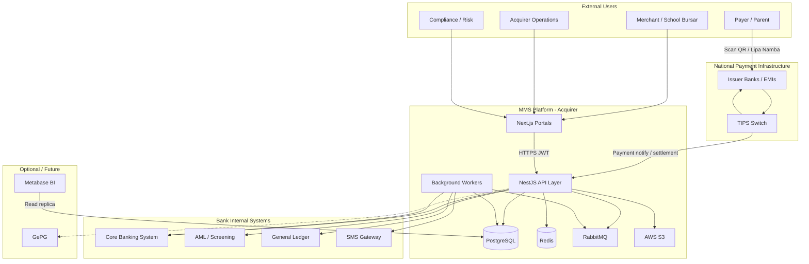
```mermaid
flowchart TB
  subgraph external_users [External Users]
    Payer[Payer / Parent]
    MerchantUser[Merchant / School Bursar]
    AcquirerOps[Acquirer Operations]
    Compliance[Compliance / Risk]
  end

  subgraph mms_platform [MMS Platform - Acquirer]
    Portal[Next.js Portals]
    API[NestJS API Layer]
    Workers[Background Workers]
    Data[(PostgreSQL)]
    Cache[(Redis)]
    Queue[RabbitMQ]
    Files[AWS S3]
  end

  subgraph national [National Payment Infrastructure]
    TIPS[TIPS Switch]
    Issuers[Issuer Banks / EMIs]
  end

  subgraph bank_internal [Bank Internal Systems]
    CBS[Core Banking System]
    AML[AML / Screening]
    GL[General Ledger]
    SMS[SMS Gateway]
  end

  subgraph optional [Optional / Future]
    GePG[GePG]
    Meta[Metabase BI]
  end

  Payer -->|Scan QR / Lipa Namba| Issuers
  Issuers --> TIPS
  TIPS -->|Payment notify / settlement| API
  MerchantUser --> Portal
  AcquirerOps --> Portal
  Compliance --> Portal
  Portal -->|HTTPS JWT| API
  API --> Data
  API --> Cache
  API --> Queue
  API --> Files
  Workers --> Queue
  Workers --> Data
  API --> CBS
  API --> AML
  Workers --> SMS
  Workers --> CBS
  Workers --> GL
  Meta -->|Read replica| Data
  API -.-> GePG
  TIPS --> Issuers
```

### 1.2 Layered architecture

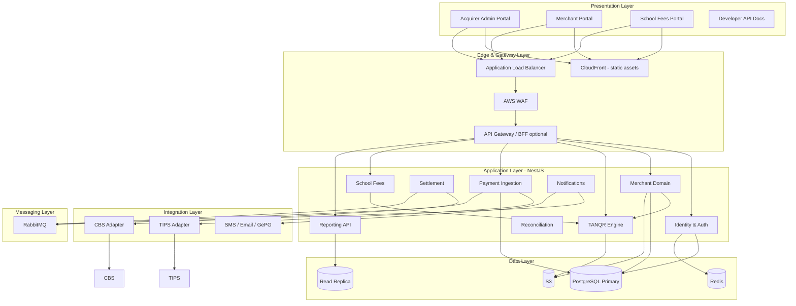
```mermaid
flowchart TB
  subgraph presentation [Presentation Layer]
    AdminUI[Acquirer Admin Portal]
    MerchantUI[Merchant Portal]
    SchoolUI[School Fees Portal]
    PublicAPI[Developer API Docs]
  end

  subgraph gateway [Edge & Gateway Layer]
    WAF[AWS WAF]
    ALB[Application Load Balancer]
    CDN[CloudFront - static assets]
    APIGW[API Gateway / BFF optional]
  end

  subgraph application [Application Layer - NestJS]
    AuthSvc[Identity & Auth]
    MerchantSvc[Merchant Domain]
    QREngine[TANQR Engine]
    PaymentSvc[Payment Ingestion]
    SettlementSvc[Settlement]
    ReconSvc[Reconciliation]
    SchoolSvc[School Fees]
    NotifySvc[Notifications]
    ReportSvc[Reporting API]
  end

  subgraph integration [Integration Layer]
    TIPSAdapter[TIPS Adapter]
    CBSAdapter[CBS Adapter]
    ChannelAdapters[SMS / Email / GePG]
  end

  subgraph data_layer [Data Layer]
    PG[(PostgreSQL Primary)]
    PGRO[(Read Replica)]
    Redis[(Redis)]
    S3[(S3)]
  end

  subgraph messaging [Messaging Layer]
    RMQ[RabbitMQ]
  end

  AdminUI & MerchantUI & SchoolUI --> CDN
  AdminUI & MerchantUI & SchoolUI --> ALB
  ALB --> WAF
  WAF --> APIGW
  APIGW --> AuthSvc & MerchantSvc & QREngine & PaymentSvc & SchoolSvc & ReportSvc
  PaymentSvc --> TIPSAdapter
  SettlementSvc --> CBSAdapter
  MerchantSvc --> QREngine
  SchoolSvc --> QREngine
  AuthSvc & MerchantSvc & PaymentSvc --> PG
  AuthSvc --> Redis
  PaymentSvc & SettlementSvc & NotifySvc --> RMQ
  NotifySvc --> ChannelAdapters
  TIPSAdapter --> TIPSExt[TIPS]
  CBSAdapter --> CBSExt[CBS]
  ReportSvc --> PGRO
  MerchantSvc --> S3
  QREngine --> S3
```

### 1.3 Deployment topology (AWS)

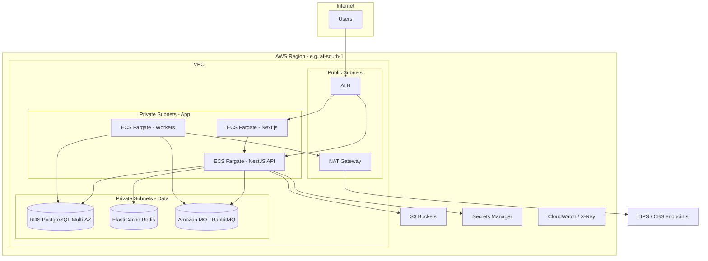
```mermaid
flowchart TB
  subgraph internet [Internet]
    Users[Users]
  end

  subgraph aws_region [AWS Region - e.g. af-south-1]
    subgraph vpc [VPC]
      subgraph public_subnet [Public Subnets]
        ALB2[ALB]
        NAT[NAT Gateway]
      end
      subgraph private_app [Private Subnets - App]
        ECS_API[ECS Fargate - NestJS API]
        ECS_Worker[ECS Fargate - Workers]
        ECS_WEB[ECS Fargate - Next.js]
      end
      subgraph private_data [Private Subnets - Data]
        RDS[(RDS PostgreSQL Multi-AZ)]
        ElastiCache[(ElastiCache Redis)]
        AmazonMQ[(Amazon MQ - RabbitMQ)]
      end
    end
    S3B[S3 Buckets]
    SM[Secrets Manager]
    CW[CloudWatch / X-Ray]
  end

  Users --> ALB2
  ALB2 --> ECS_WEB
  ALB2 --> ECS_API
  ECS_WEB --> ECS_API
  ECS_API --> RDS
  ECS_API --> ElastiCache
  ECS_API --> AmazonMQ
  ECS_Worker --> AmazonMQ
  ECS_Worker --> RDS
  ECS_API --> S3B
  ECS_API --> SM
  ECS_Worker --> NAT
  NAT --> TIPSCloud[TIPS / CBS endpoints]
```

### 1.4 Architecture principles

| Principle | Implementation |
|-----------|----------------|
| **Switch-aligned** | TIPS adapter owns all national switch messaging; no bypass |
| **Standards-first QR** | TANQR engine isolated; CRC + EMV payload rules centralized |
| **Acquirer sovereignty** | CBS is system of record for money movement; MMS orchestrates |
| **Async by default** | Notifications, settlement, recon via RabbitMQ |
| **Audit everything** | Immutable audit log; correlation IDs end-to-end |
| **Defense in depth** | WAF → JWT → RBAC → network segmentation → encryption |
| **Read/write split** | Reporting on replica; OLTP on primary |

---

## 2. Low level architecture

### 2.1 NestJS modular decomposition

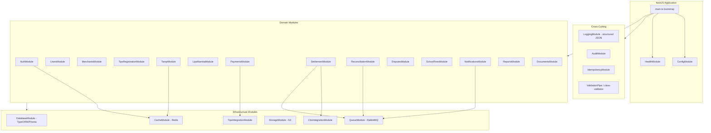
```mermaid
flowchart TB
  subgraph bootstrap [NestJS Application]
    Main[main.ts bootstrap]
    Config[ConfigModule]
    Health[HealthModule]
  end

  subgraph cross_cutting [Cross-Cutting]
    Logger[LoggingModule - structured JSON]
    Audit[AuditModule]
    Idempotency[IdempotencyModule]
    Validation[ValidationPipe / class-validator]
  end

  subgraph domain_modules [Domain Modules]
    AuthMod[AuthModule]
    UserMod[UsersModule]
    MerchantMod[MerchantsModule]
    TipsRegMod[TipsRegistrationModule]
    QRMod[TanqrModule]
    AliasMod[LipaNambaModule]
    PaymentMod[PaymentsModule]
    SettlementMod[SettlementModule]
    ReconMod[ReconciliationModule]
    DisputeMod[DisputesModule]
    SchoolMod[SchoolFeesModule]
    NotifyMod[NotificationsModule]
    ReportMod[ReportsModule]
    DocMod[DocumentsModule]
  end

  subgraph infra_modules [Infrastructure Modules]
    DbMod[DatabaseModule - TypeORM/Prisma]
    CacheMod[CacheModule - Redis]
    QueueMod[QueueModule - RabbitMQ]
    StorageMod[StorageModule - S3]
    TipsInt[TipsIntegrationModule]
    CbsInt[CbsIntegrationModule]
  end

  Main --> Config & Health
  Main --> cross_cutting
  Main --> domain_modules
  domain_modules --> infra_modules
  PaymentMod --> TipsInt
  SettlementMod --> CbsInt
  QRMod --> CacheMod
  AuthMod --> CacheMod
  NotifyMod --> QueueMod
  SettlementMod --> QueueMod
  ReconMod --> QueueMod
```

### 2.2 Next.js application structure

```mermaid
flowchart LR
  subgraph next_app [Next.js Frontend]
    subgraph routes [App Router]
      AuthR[/login /logout]
      AdminR[/admin/*]
      MerchantR[/merchant/*]
      SchoolR[/school/*]
      ReportsR[/reports/*]
    end
    subgraph client [Client Layer]
      APIClient[API Client - axios/fetch]
      AuthCtx[Auth Context - tokens]
      RQ[React Query cache]
    end
    subgraph ui [UI Components]
      Layout[Layouts / RBAC guards]
      QRView[QR Preview / Download]
      Dash[Dashboards]
    end
  end

  AuthR --> AuthCtx
  AdminR & MerchantR & SchoolR --> Layout
  Layout --> APIClient
  APIClient -->|REST + JWT| NestAPI[NestJS API]
  QRView --> APIClient
  Dash --> RQ
  RQ --> APIClient
```

### 2.3 Worker processes (async)

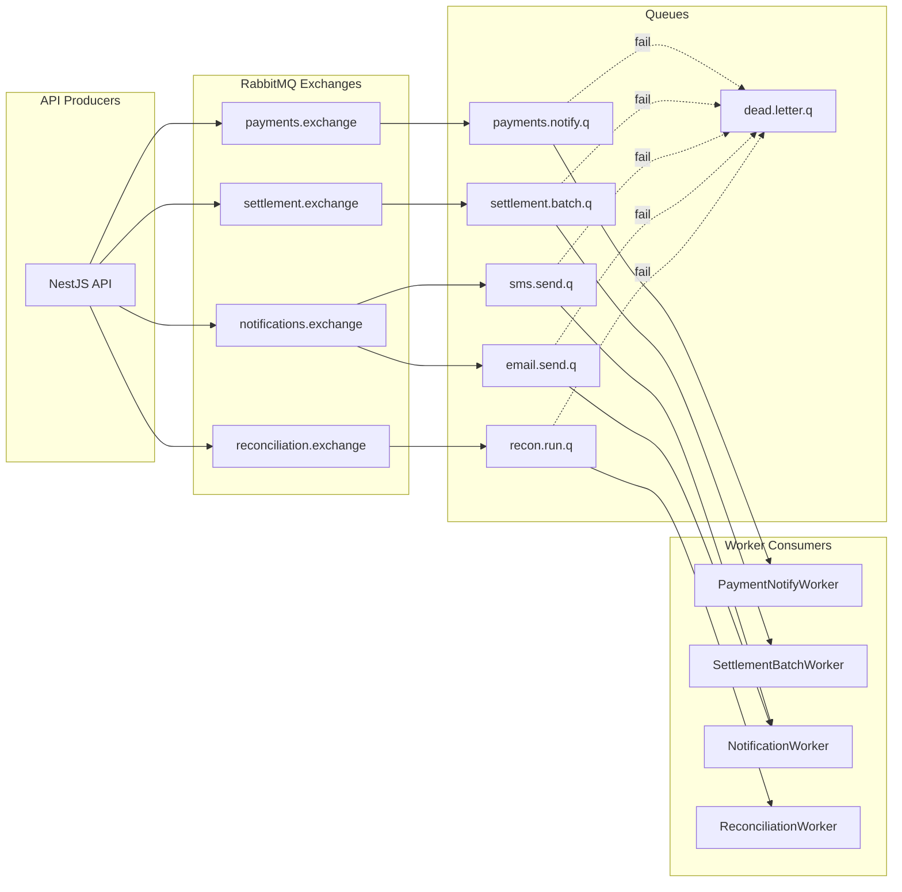
```mermaid
flowchart LR
  subgraph producers [API Producers]
    API1[NestJS API]
  end

  subgraph exchanges [RabbitMQ Exchanges]
    EX_PAY[payments.exchange]
    EX_SET[settlement.exchange]
    EX_NOT[notifications.exchange]
    EX_RECON[reconciliation.exchange]
  end

  subgraph queues [Queues]
    Q_PAY[payments.notify.q]
    Q_SET[settlement.batch.q]
    Q_SMS[sms.send.q]
    Q_EMAIL[email.send.q]
    Q_RECON[recon.run.q]
    Q_DLQ[dead.letter.q]
  end

  subgraph consumers [Worker Consumers]
    W1[PaymentNotifyWorker]
    W2[SettlementBatchWorker]
    W3[NotificationWorker]
    W4[ReconciliationWorker]
  end

  API1 --> EX_PAY & EX_SET & EX_NOT & EX_RECON
  EX_PAY --> Q_PAY --> W1
  EX_SET --> Q_SET --> W2
  EX_NOT --> Q_SMS & Q_EMAIL --> W3
  EX_RECON --> Q_RECON --> W4
  Q_PAY & Q_SET & Q_SMS & Q_EMAIL & Q_RECON -.->|fail| Q_DLQ
```

### 2.4 TANQR engine (internal component design)

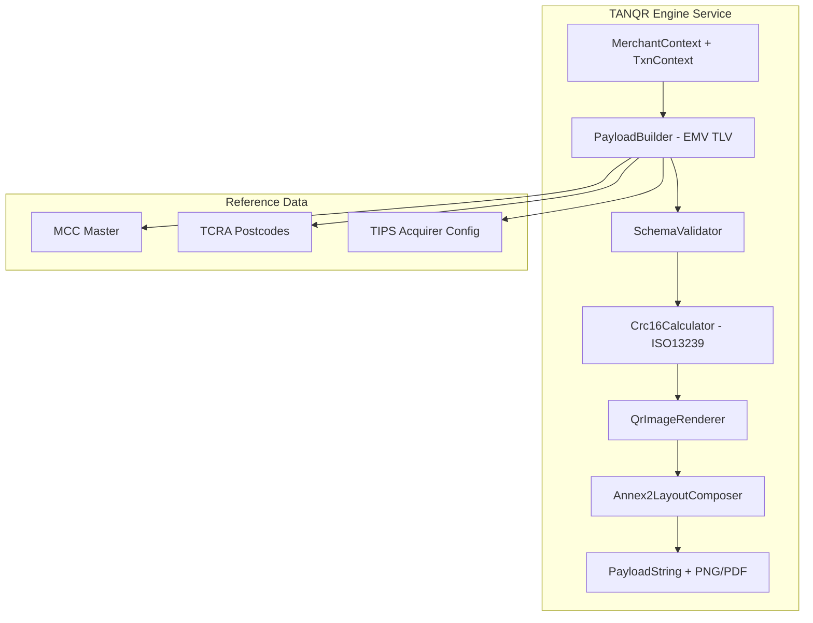
```mermaid
flowchart TB
  subgraph tanqr_engine [TANQR Engine Service]
    Input[MerchantContext + TxnContext]
    Builder[PayloadBuilder - EMV TLV]
    Validator[SchemaValidator]
    CRC[Crc16Calculator - ISO13239]
    Renderer[QrImageRenderer]
    Template[Annex2LayoutComposer]
    Output[PayloadString + PNG/PDF]
  end

  Input --> Builder
  Builder --> Validator
  Validator --> CRC
  CRC --> Renderer
  Renderer --> Template
  Template --> Output

  subgraph data_refs [Reference Data]
    MCC[MCC Master]
    Postcode[TCRA Postcodes]
    TipsIds[TIPS Acquirer Config]
  end

  Builder --> MCC & Postcode & TipsIds
```

### 2.5 Request path (synchronous API)

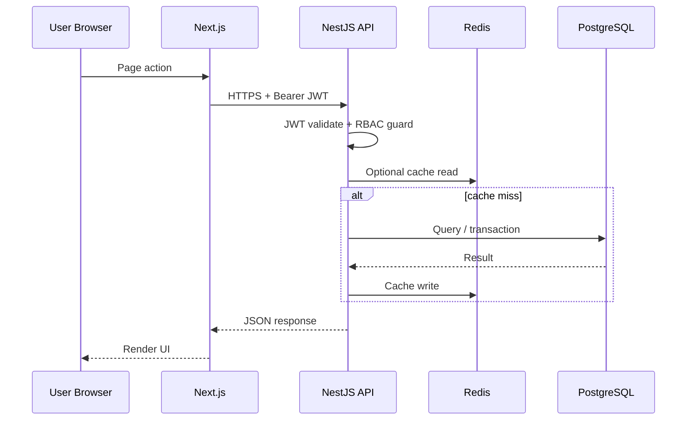
```mermaid
sequenceDiagram
  participant U as User Browser
  participant N as Next.js
  participant A as NestJS API
  participant R as Redis
  participant P as PostgreSQL

  U->>N: Page action
  N->>A: HTTPS + Bearer JWT
  A->>A: JWT validate + RBAC guard
  A->>R: Optional cache read
  alt cache miss
    A->>P: Query / transaction
    P-->>A: Result
    A->>R: Cache write
  end
  A-->>N: JSON response
  N-->>U: Render UI
```

---

## 3. Service boundaries

### 3.1 Bounded contexts (DDD)

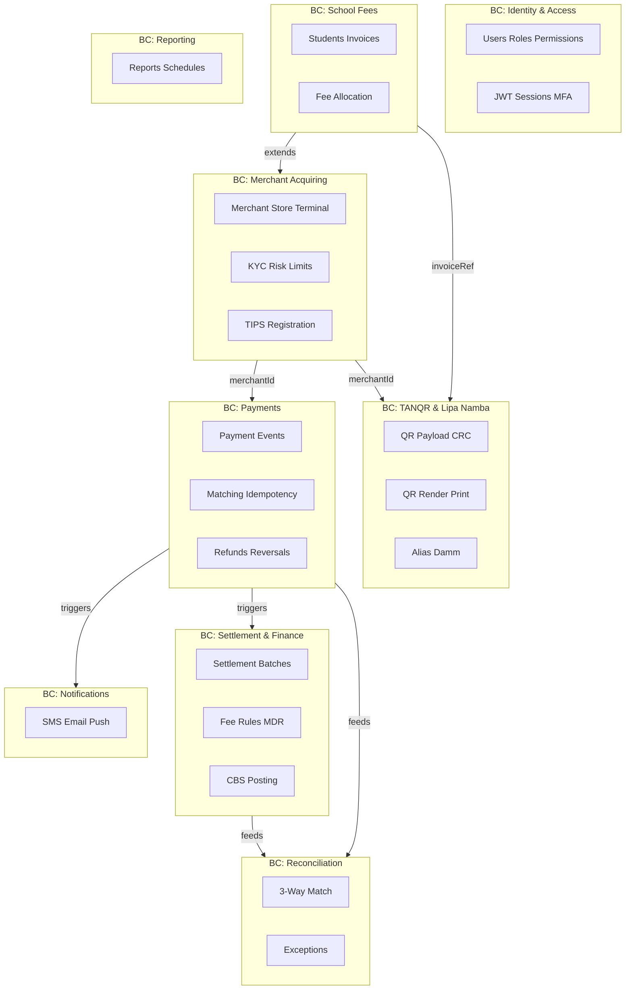
```mermaid
flowchart TB
  subgraph bc_identity [BC: Identity & Access]
    I1[Users Roles Permissions]
    I2[JWT Sessions MFA]
  end

  subgraph bc_merchant [BC: Merchant Acquiring]
    M1[Merchant Store Terminal]
    M2[KYC Risk Limits]
    M3[TIPS Registration]
  end

  subgraph bc_qr [BC: TANQR & Lipa Namba]
    Q1[QR Payload CRC]
    Q2[QR Render Print]
    Q3[Alias Damm]
  end

  subgraph bc_payment [BC: Payments]
    P1[Payment Events]
    P2[Matching Idempotency]
    P3[Refunds Reversals]
  end

  subgraph bc_settlement [BC: Settlement & Finance]
    S1[Settlement Batches]
    S2[Fee Rules MDR]
    S3[CBS Posting]
  end

  subgraph bc_recon [BC: Reconciliation]
    R1[3-Way Match]
    R2[Exceptions]
  end

  subgraph bc_school [BC: School Fees]
    SF1[Students Invoices]
    SF2[Fee Allocation]
  end

  subgraph bc_notify [BC: Notifications]
    N1[SMS Email Push]
  end

  subgraph bc_report [BC: Reporting]
    RP1[Reports Schedules]
  end

  bc_merchant -->|merchantId| bc_qr
  bc_merchant -->|merchantId| bc_payment
  bc_school -->|extends| bc_merchant
  bc_school -->|invoiceRef| bc_qr
  bc_payment -->|triggers| bc_settlement
  bc_payment -->|triggers| bc_notify
  bc_settlement -->|feeds| bc_recon
  bc_payment -->|feeds| bc_recon
```

### 3.2 Service ownership matrix

| Service / Module | Owns data | Publishes events | Consumes events | External deps |
|------------------|-----------|------------------|-----------------|---------------|
| **AuthModule** | users, sessions, refresh_tokens | user.created | — | Redis |
| **MerchantsModule** | merchants, stores, terminals, kyc | merchant.approved | — | AML (sync) |
| **TipsRegistrationModule** | tips_registrations | merchant.tips.registered | — | TIPS Directory |
| **TanqrModule** | qr_codes, qr_templates | qr.issued, qr.revoked | merchant.approved | — |
| **LipaNambaModule** | merchant_aliases | alias.created | merchant.approved | — |
| **PaymentsModule** | payments, payment_events | payment.received | tips.payment.confirmed | TIPS |
| **SettlementModule** | settlement_batches, fees | settlement.batch.ready | payment.received | CBS |
| **ReconciliationModule** | recon_runs, exceptions | recon.completed | settlement.posted | TIPS, CBS files |
| **SchoolFeesModule** | schools, students, invoices | invoice.created | payment.received | — |
| **NotificationsModule** | notification_log | — | payment.*, settlement.* | SMS |
| **ReportsModule** | report_jobs | — | — | Read replica |
| **DocumentsModule** | document_metadata | — | — | S3 |

### 3.3 API boundary rules

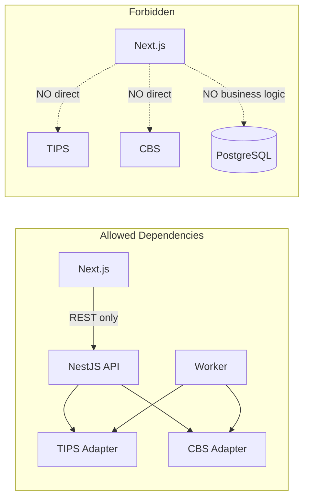
```mermaid
flowchart LR
  subgraph allowed [Allowed Dependencies]
    UI[Next.js] -->|REST only| API[NestJS API]
    API --> TIPS[TIPS Adapter]
    API --> CBS[CBS Adapter]
    Worker --> TIPS
    Worker --> CBS
  end

  subgraph forbidden [Forbidden]
    UI2[Next.js] -.->|NO direct| TIPS2[TIPS]
    UI2 -.->|NO direct| CBS2[CBS]
    UI2 -.->|NO business logic| DB[(PostgreSQL)]
  end
```

| Rule | Rationale |
|------|-----------|
| Next.js never calls TIPS/CBS directly | Security, credential isolation, audit |
| All money messages via Payment/Settlement services | Single idempotency & posting model |
| TANQR generation only via TanqrModule | Standards compliance |
| School fees never bypass PaymentsModule | Unified txn ledger |

### 3.4 Context integration patterns

| From → To | Pattern | Contract |
|-----------|---------|----------|
| Merchant → TANQR | Domain event | `merchant.approved` |
| TANQR → Payment | Shared merchantId, alias | Lookup table |
| Payment → Settlement | Async message | `payment.received` |
| Settlement → Recon | Batch file + DB | `settlement_batch_id` |
| School → TANQR | Command | `GenerateDynamicQr(invoiceId)` |
| All → Audit | Sidecar | Correlation ID header `X-Correlation-Id` |

---

## 4. Database architecture

### 4.1 Database topology

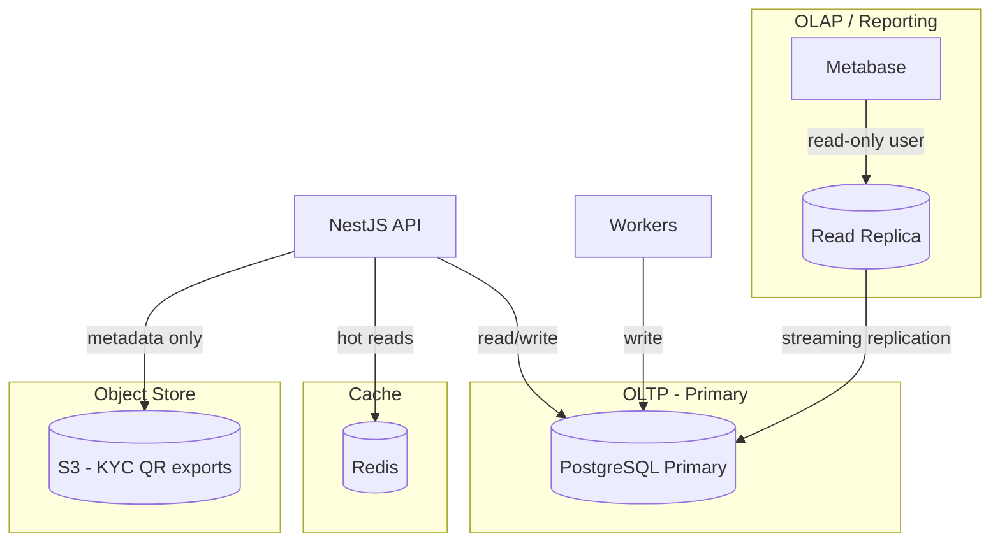
```mermaid
flowchart TB
  subgraph oltp [OLTP - Primary]
    Primary[(PostgreSQL Primary)]
  end

  subgraph olap [OLAP / Reporting]
    Replica[(Read Replica)]
    Meta[Metabase]
  end

  subgraph cache [Cache]
    Redis[(Redis)]
  end

  subgraph object [Object Store]
    S3[(S3 - KYC QR exports)]
  end

  App[NestJS API] -->|read/write| Primary
  Workers[Workers] -->|write| Primary
  App -->|hot reads| Redis
  Replica -->|streaming replication| Primary
  Meta -->|read-only user| Replica
  App -->|metadata only| S3
```

### 4.2 Schema domains (logical ERD overview)

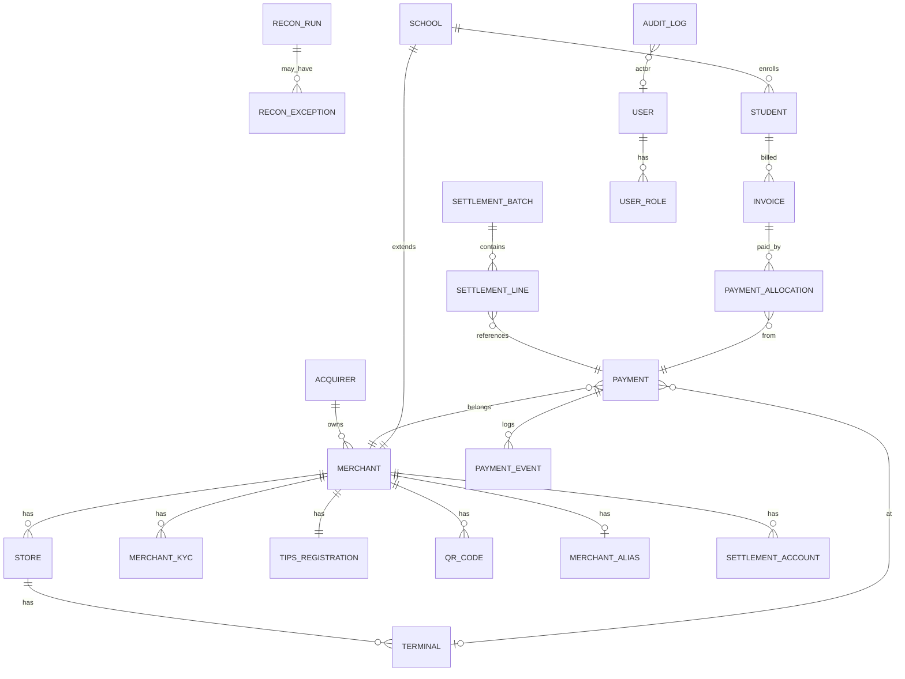
```mermaid
erDiagram
  ACQUIRER ||--o{ MERCHANT : owns
  MERCHANT ||--o{ STORE : has
  STORE ||--o{ TERMINAL : has
  MERCHANT ||--o{ MERCHANT_KYC : has
  MERCHANT ||--|| TIPS_REGISTRATION : has
  MERCHANT ||--o{ QR_CODE : has
  MERCHANT ||--o| MERCHANT_ALIAS : has
  MERCHANT ||--o{ SETTLEMENT_ACCOUNT : has

  PAYMENT ||--o{ PAYMENT_EVENT : logs
  PAYMENT }o--|| MERCHANT : belongs
  PAYMENT }o--o| TERMINAL : at

  SETTLEMENT_BATCH ||--o{ SETTLEMENT_LINE : contains
  SETTLEMENT_LINE }o--|| PAYMENT : references

  RECON_RUN ||--o{ RECON_EXCEPTION : may_have

  SCHOOL ||--|| MERCHANT : extends
  SCHOOL ||--o{ STUDENT : enrolls
  STUDENT ||--o{ INVOICE : billed
  INVOICE ||--o{ PAYMENT_ALLOCATION : paid_by
  PAYMENT_ALLOCATION }o--|| PAYMENT : from

  USER ||--o{ USER_ROLE : has
  AUDIT_LOG }o--o| USER : actor
```

### 4.3 Core table groups

| Schema group | Tables (representative) | Retention |
|--------------|-------------------------|-----------|
| **acquirer** | acquirers, participants, fee_rules | Permanent |
| **merchant** | merchants, stores, terminals, mcc_ref, postcodes | Permanent |
| **kyc** | kyc_documents, kyc_reviews, risk_scores | 7+ years |
| **tips** | tips_registrations, tips_message_log | 7+ years |
| **qr** | qr_codes, qr_payload_versions, qr_render_assets | Permanent |
| **payments** | payments, payment_events, idempotency_keys | 7+ years |
| **settlement** | settlement_batches, settlement_lines, cbs_postings | 7+ years |
| **reconciliation** | recon_runs, recon_matches, recon_exceptions | 7+ years |
| **school** | schools, academic_years, terms, students, invoices, allocations | 7+ years |
| **identity** | users, roles, permissions, refresh_tokens | Active + audit |
| **audit** | audit_logs (append-only) | 7+ years |
| **notifications** | notification_templates, notification_log | 2+ years |

### 4.4 Key indexing & partitioning strategy

| Table | Index / partition | Purpose |
|-------|-------------------|---------|
| `payments` | `(merchant_id, created_at DESC)` | Merchant portal |
| `payments` | `(tips_reference)` UNIQUE | Idempotency |
| `payments` | `(status, created_at)` | Ops dashboard |
| `payments` | RANGE partition by month | Scale |
| `audit_logs` | `(entity_type, entity_id, ts)` | Investigations |
| `qr_codes` | `(merchant_id, type, active)` | QR lookup |

### 4.5 Data flow classification

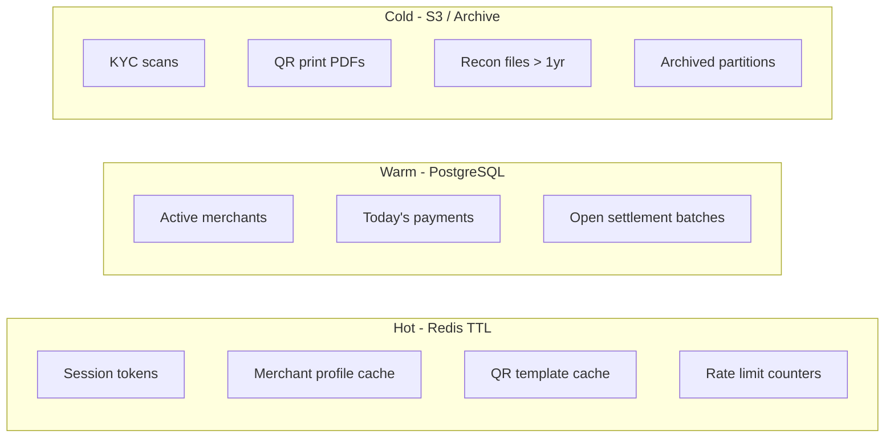
```mermaid
flowchart LR
  subgraph hot [Hot - Redis TTL]
    S1[Session tokens]
    S2[Merchant profile cache]
    S3[QR template cache]
    S4[Rate limit counters]
  end

  subgraph warm [Warm - PostgreSQL]
    W1[Active merchants]
    W2[Today's payments]
    W3[Open settlement batches]
  end

  subgraph cold [Cold - S3 / Archive]
    C1[KYC scans]
    C2[QR print PDFs]
    C3[Recon files > 1yr]
    C4[Archived partitions]
  end
```

---

## 5. Security architecture

### 5.1 Security zones

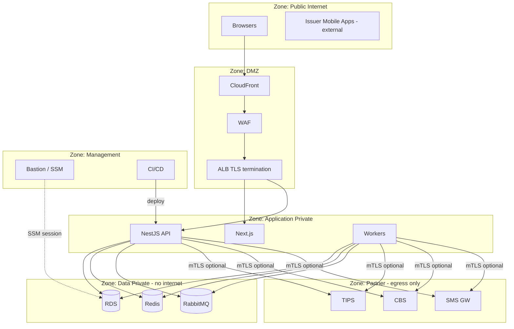
```mermaid
flowchart TB
  subgraph zone_public [Zone: Public Internet]
    Browser[Browsers]
    Mobile[Issuer Mobile Apps - external]
  end

  subgraph zone_dmz [Zone: DMZ]
    WAF[WAF]
    ALB[ALB TLS termination]
    CF[CloudFront]
  end

  subgraph zone_app [Zone: Application Private]
    API[NestJS API]
    WEB[Next.js]
    Workers[Workers]
  end

  subgraph zone_data [Zone: Data Private - no internet]
    RDS[(RDS)]
    Redis[(Redis)]
    RMQ[(RabbitMQ)]
  end

  subgraph zone_mgmt [Zone: Management]
    Bastion[Bastion / SSM]
    CI[CI/CD]
  end

  subgraph zone_partner [Zone: Partner - egress only]
    TIPS[TIPS]
    CBS[CBS]
    SMS[SMS GW]
  end

  Browser --> CF --> WAF --> ALB
  ALB --> WEB & API
  API & Workers --> RDS & Redis & RMQ
  API & Workers -->|mTLS optional| TIPS & CBS & SMS
  CI -->|deploy| API
  Bastion -.->|SSM session| RDS
```

### 5.2 Authentication & token flow

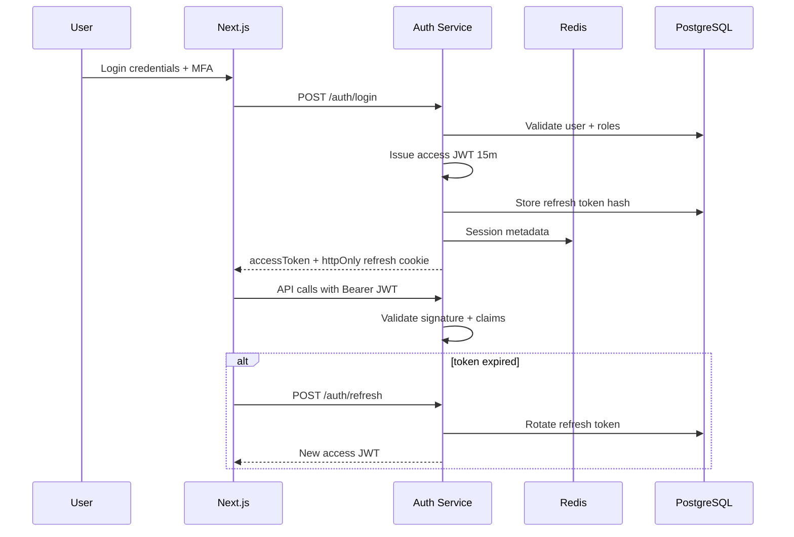
```mermaid
sequenceDiagram
  participant U as User
  participant N as Next.js
  participant A as Auth Service
  participant R as Redis
  participant DB as PostgreSQL

  U->>N: Login credentials + MFA
  N->>A: POST /auth/login
  A->>DB: Validate user + roles
  A->>A: Issue access JWT 15m
  A->>DB: Store refresh token hash
  A->>R: Session metadata
  A-->>N: accessToken + httpOnly refresh cookie
  N->>A: API calls with Bearer JWT
  A->>A: Validate signature + claims
  alt token expired
    N->>A: POST /auth/refresh
    A->>DB: Rotate refresh token
    A-->>N: New access JWT
  end
```

### 5.3 Authorization model (RBAC)

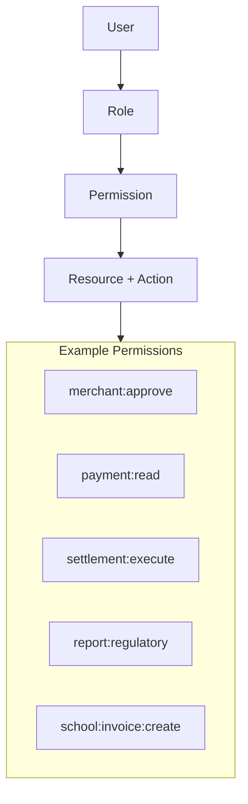
```mermaid
flowchart TB
  User[User] --> Role[Role]
  Role --> Perm[Permission]
  Perm --> Res[Resource + Action]

  subgraph examples [Example Permissions]
    E1[merchant:approve]
    E2[payment:read]
    E3[settlement:execute]
    E4[report:regulatory]
    E5[school:invoice:create]
  end

  Res --> examples
```

### 5.4 Security controls map (BRD → architecture)

| BRD SEC ID | Control | Architecture component |
|------------|---------|------------------------|
| SEC-01–02 | JWT + refresh rotation | AuthModule, httpOnly cookie, Redis denylist |
| SEC-04 | MFA | TOTP/WebAuthn via AuthModule |
| SEC-07 | API keys | Hashed keys, scoped integrator role |
| SEC-10–11 | TLS + encryption at rest | ALB TLS 1.3, RDS KMS, S3 SSE-KMS |
| SEC-12 | PII encryption | Column-level AES for NIDA/phone |
| SEC-20–21 | OWASP | Input validation, ORM only, CSP headers |
| SEC-22 | Rate limiting | Redis sliding window at gateway |
| SEC-23 | Webhook HMAC | TIPS callback signature verification |
| SEC-24 | QR tamper | CRC validation in TanqrModule |
| SEC-35 | SIEM | CloudWatch → alerting, audit_logs |

### 5.5 Secrets & key management

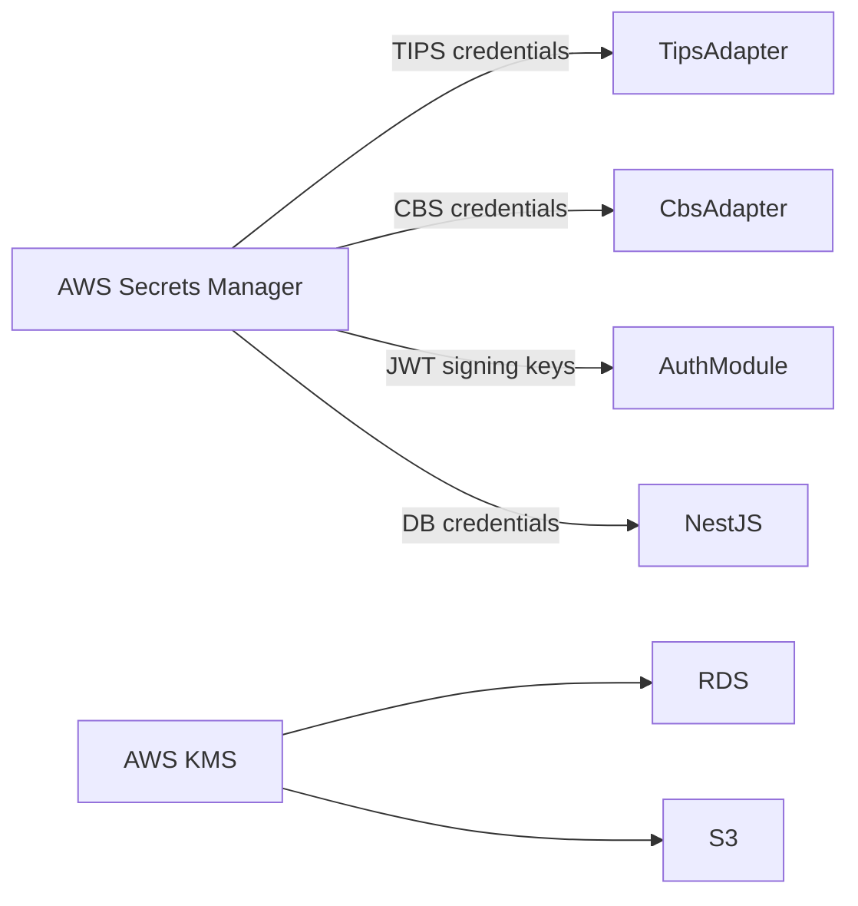
```mermaid
flowchart LR
  SM[AWS Secrets Manager]
  KMS[AWS KMS]

  SM -->|TIPS credentials| TipsAdapter
  SM -->|CBS credentials| CbsAdapter
  SM -->|JWT signing keys| AuthModule
  SM -->|DB credentials| NestJS
  KMS --> RDS
  KMS --> S3
```

---

## 6. Integration architecture

### 6.1 Integration landscape

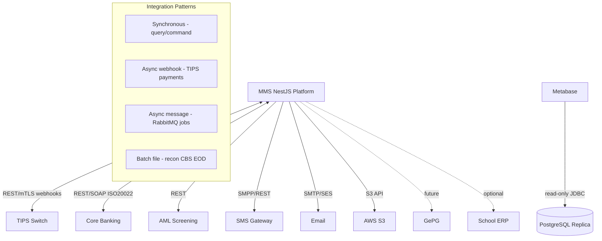
```mermaid
flowchart TB
  MMS[MMS NestJS Platform]

  MMS <-->|REST/mTLS webhooks| TIPS[TIPS Switch]
  MMS <-->|REST/SOAP ISO20022| CBS[Core Banking]
  MMS -->|REST| AML[AML Screening]
  MMS -->|SMPP/REST| SMS[SMS Gateway]
  MMS -->|SMTP/SES| Email[Email]
  MMS -->|S3 API| S3[AWS S3]
  MMS -.->|future| GePG[GePG]
  MMS -.->|optional| ERP[School ERP]

  Meta[Metabase] -->|read-only JDBC| RDS[(PostgreSQL Replica)]

  subgraph patterns [Integration Patterns]
    P1[Synchronous - query/command]
    P2[Async webhook - TIPS payments]
    P3[Async message - RabbitMQ jobs]
    P4[Batch file - recon CBS EOD]
  end
```

### 6.2 Integration adapter pattern

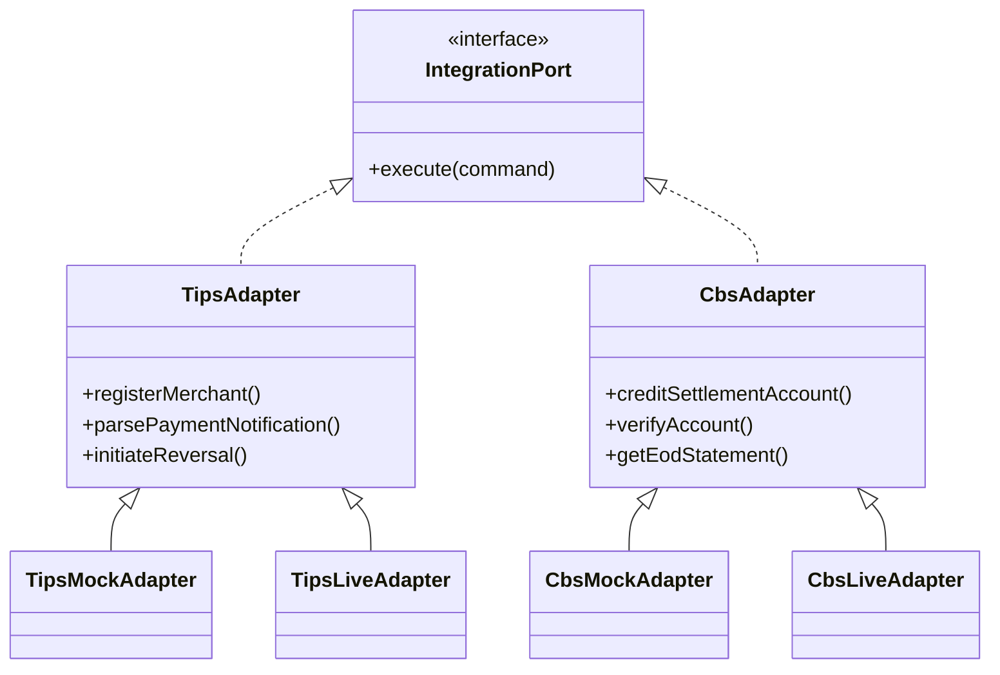
```mermaid
classDiagram
  class IntegrationPort {
    <<interface>>
    +execute(command)
  }
  class TipsAdapter {
    +registerMerchant()
    +parsePaymentNotification()
    +initiateReversal()
  }
  class CbsAdapter {
    +creditSettlementAccount()
    +verifyAccount()
    +getEodStatement()
  }
  class TipsMockAdapter
  class TipsLiveAdapter
  class CbsMockAdapter
  class CbsLiveAdapter

  IntegrationPort <|.. TipsAdapter
  IntegrationPort <|.. CbsAdapter
  TipsAdapter <|-- TipsMockAdapter
  TipsAdapter <|-- TipsLiveAdapter
  CbsAdapter <|-- CbsMockAdapter
  CbsAdapter <|-- CbsLiveAdapter
```

### 6.3 Message & correlation model

| Field | Propagation |
|-------|-------------|
| `correlationId` | HTTP header → logs → RabbitMQ → TIPS/CBS |
| `idempotencyKey` | Payment webhooks, CBS posting |
| `tipsEndToEndId` | TIPS ↔ payments table UNIQUE |
| `merchantId` | All domain events |
| `settlementBatchId` | Settlement → recon |

### 6.4 Error handling & resilience

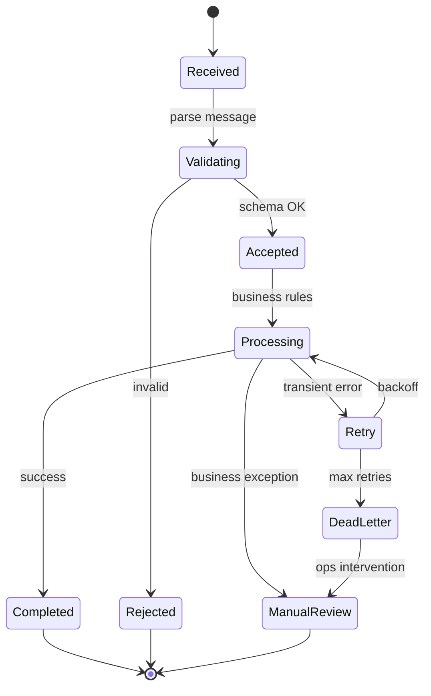
```mermaid
stateDiagram-v2
  [*] --> Received
  Received --> Validating: parse message
  Validating --> Accepted: schema OK
  Validating --> Rejected: invalid
  Accepted --> Processing: business rules
  Processing --> Completed: success
  Processing --> Retry: transient error
  Retry --> Processing: backoff
  Retry --> DeadLetter: max retries
  Processing --> ManualReview: business exception
  DeadLetter --> ManualReview: ops intervention
  Completed --> [*]
  Rejected --> [*]
  ManualReview --> [*]
```

---

## 7. TIPS integration flow

### 7.1 TIPS integration components

```mermaid
flowchart LR
  subgraph mms_tips [MMS TIPS Integration]
    RegAPI[Registration API Client]
    PayHook[Payment Webhook Controller]
    DirSync[Directory Sync Job]
    RevAPI[Reversal API Client]
    MsgLog[Message Audit Log]
  end

  TIPS[TIPS Platform]
  Dir[TIPS Directory Service]

  RegAPI --> TIPS
  PayHook <-- TIPS
  DirSync --> Dir
  RevAPI --> TIPS
  RegAPI & PayHook & RevAPI --> MsgLog
```

### 7.2 Merchant registration on TIPS

```mermaid
sequenceDiagram
  participant Ops as Acquirer Ops
  participant MMS as MMS MerchantsModule
  participant TR as TipsRegistrationModule
  participant TIPS as TIPS Directory
  participant DB as PostgreSQL

  Ops->>MMS: Approve merchant KYC
  MMS->>DB: status = APPROVED
  MMS->>TR: RegisterMerchantCommand
  TR->>TR: Build Acquirer ID 5-digit
  TR->>TR: Assign Merchant ID <=15 digits
  TR->>TR: Generate Lipa Namba alias + Damm
  TR->>TIPS: POST register merchant
  TIPS-->>TR: ACK + directory entry
  TR->>DB: tips_registrations SUCCESS
  TR-->>MMS: merchant.tips.registered event
  MMS->>MMS: Trigger QR issuance
```

### 7.3 Payment notification flow (TIPS → MMS)

```mermaid
sequenceDiagram
  participant TIPS as TIPS Switch
  participant Hook as Payment Webhook
  participant Pay as PaymentsModule
  participant Idem as Idempotency Store
  participant DB as PostgreSQL
  participant Q as RabbitMQ
  participant W as Notify Worker

  TIPS->>Hook: POST payment confirmation
  Hook->>Hook: Verify mTLS / HMAC signature
  Hook->>Idem: Check tipsEndToEndId
  alt duplicate
    Hook-->>TIPS: 200 OK already processed
  else new
    Hook->>Pay: ProcessPaymentNotification
    Pay->>DB: INSERT payment SUCCESS
    Pay->>DB: INSERT payment_event
    Pay->>Q: publish payment.received
    Hook-->>TIPS: 200 OK
    Q->>W: consume event
    W->>W: SMS/email merchant
  end
```

### 7.4 Transfer reversal flow

```mermaid
sequenceDiagram
  participant Ops as Operations
  participant MMS as DisputesModule
  participant TIPS as TIPS
  participant Pay as PaymentsModule
  participant DB as PostgreSQL

  Ops->>MMS: Initiate reversal
  MMS->>DB: payment status REVERSAL_PENDING
  MMS->>TIPS: POST reversal request
  TIPS-->>MMS: reversal accepted
  MMS->>DB: payment status REVERSED
  MMS->>DB: audit log
```

---

## 8. CBS integration flow

### 8.1 CBS integration scope

| Function | Direction | Purpose |
|----------|-----------|---------|
| Account verification | MMS → CBS | Validate settlement account at onboarding |
| Settlement credit | MMS → CBS | Credit merchant settlement account |
| Fee debit | MMS → CBS | Deduct MDR/switch fees per policy |
| GL posting | MMS → CBS / GL | Accounting entries |
| EOD statement | CBS → MMS | Reconciliation input |

### 8.2 Account verification (onboarding)

```mermaid
sequenceDiagram
  participant Ops as Acquirer Ops
  participant MMS as MerchantsModule
  participant CBS as Core Banking
  participant DB as PostgreSQL

  Ops->>MMS: Submit settlement account
  MMS->>CBS: Account enquiry API
  CBS-->>MMS: Account name match result
  alt match OK
    MMS->>DB: settlement_account VERIFIED
  else mismatch
    MMS->>DB: flag KYC exception
  end
```

### 8.3 Settlement posting to CBS

```mermaid
sequenceDiagram
  participant Set as SettlementModule
  participant Q as RabbitMQ
  participant W as Settlement Worker
  participant CBS as Core Banking
  participant DB as PostgreSQL
  participant GL as General Ledger

  Set->>DB: Create settlement_batch APPROVED
  Set->>Q: settlement.batch.ready
  Q->>W: consume
  loop each settlement_line
    W->>CBS: Credit merchant account API
    CBS-->>W: posting reference
    W->>DB: cbs_posting SUCCESS
    W->>GL: journal entry optional
  end
  W->>DB: batch status POSTED
  W->>Q: settlement.posted event
```

### 8.4 CBS failure handling

```mermaid
flowchart TD
  A[Settlement line ready] --> B{CBS call}
  B -->|Success| C[Mark POSTED]
  B -->|Transient| D[Retry queue max 5]
  B -->|Hard fail| E[Mark FAILED]
  D --> B
  E --> F[Ops exception queue]
  F --> G{Manual action}
  G -->|Retry| B
  G -->|Cancel| H[Reverse internal ledger]
```

---

## 9. QR payment flow

### 9.1 Static vs dynamic QR decision

```mermaid
flowchart TD
  Start[Payment scenario] --> Q1{Fixed amount known?}
  Q1 -->|No| Static[Static QR POI 11]
  Q1 -->|Yes| Dynamic[Dynamic QR POI 12]
  Static --> S1[Payer enters amount]
  Dynamic --> D1[Amount in ID 54]
  S1 & D1 --> Scan[Payer scans via issuer app]
  Scan --> TIPSFlow[TIPS payment flow]
```

### 9.2 Dynamic QR generation (MMS internal)

```mermaid
sequenceDiagram
  participant M as Merchant Portal
  participant API as TanqrModule
  participant Eng as TANQR Engine
  participant DB as PostgreSQL
  participant S3 as S3

  M->>API: Request QR for invoice
  API->>DB: Load merchant TIPS ID26 profile
  API->>Eng: Build TLV payload
  Eng->>Eng: Set ID26 tz.go.bot.tips
  Eng->>Eng: Set amount ID54 currency 834
  Eng->>Eng: Set bill ref ID62-01
  Eng->>Eng: Compute CRC ID63
  Eng-->>API: payload string
  API->>Eng: Render Annex2 layout
  API->>S3: Store PNG/PDF
  API->>DB: qr_codes record
  API-->>M: QR image URL + payload
```

### 9.3 End-to-end QR payment flow (static)

```mermaid
sequenceDiagram
  participant Merchant as Merchant
  participant Payer as Payer
  participant Issuer as Issuer App
  participant TIPS as TIPS
  participant MMS as MMS
  participant CBS as CBS

  Merchant->>Merchant: Display static TANQR
  Payer->>Issuer: Scan QR
  Issuer->>Issuer: Decode EMV payload verify CRC
  Issuer->>Payer: Show merchant name amount entry
  Payer->>Issuer: Confirm amount
  Issuer->>TIPS: Payment initiation
  TIPS->>TIPS: Route issuer to acquirer
  TIPS->>MMS: Payment notification webhook
  MMS->>MMS: Post payment + notify merchant
  TIPS->>CBS: Settlement per TIPS rules
  MMS->>Merchant: Real-time notification
```

### 9.4 End-to-end QR payment flow (dynamic)

```mermaid
sequenceDiagram
  participant MMS as MMS
  participant Merchant as Merchant
  participant Payer as Payer
  participant Issuer as Issuer App
  participant TIPS as TIPS

  MMS->>MMS: Generate dynamic QR per invoice
  Merchant->>Payer: Show QR checkout
  Payer->>Issuer: Scan QR
  Issuer->>Issuer: Amount pre-filled from ID54
  Payer->>Issuer: Confirm payment
  Issuer->>TIPS: Payment initiation
  TIPS->>MMS: Webhook with bill reference
  MMS->>MMS: Match invoice mark PAID
  MMS->>Merchant: Payment confirmation
```

### 9.5 Lipa Namba (feature phone) flow

```mermaid
sequenceDiagram
  participant Payer as Payer USSD
  participant Issuer as Issuer EMI
  participant TIPS as TIPS Directory
  participant MMS as MMS

  Note over MMS: Alias 8-digit AAA-CCCC-S on QR Part C
  Payer->>Issuer: Dial Lipa Namba enter 00112349
  Issuer->>TIPS: Resolve alias to merchant ID26
  TIPS->>Issuer: Merchant details
  Payer->>Issuer: Enter amount confirm
  Issuer->>TIPS: Process P2B
  TIPS->>MMS: Payment notification
  MMS->>MMS: Match merchant alias
```

---

## 10. School fee collection flow

### 10.1 School fees domain architecture

```mermaid
flowchart TB
  subgraph school_portal [School Portal - Next.js]
    Bursar[School Bursar UI]
  end

  subgraph school_api [SchoolFeesModule]
    FeeCatalog[Fee Catalog]
    StudentReg[Student Registry]
    Invoicing[Invoicing Engine]
    Alloc[Payment Allocator]
  end

  subgraph shared [Shared Platform]
    Tanqr[TANQR Engine]
    Pay[PaymentsModule]
    Notify[Notifications]
  end

  Bursar --> school_api
  Invoicing --> Tanqr
  Pay --> Alloc
  Alloc --> Invoicing
  Pay --> Notify
```

### 10.2 Term fee billing & QR issuance

```mermaid
sequenceDiagram
  participant Bursar as School Bursar
  participant SF as SchoolFeesModule
  participant DB as PostgreSQL
  participant QR as TanqrModule
  participant Parent as Parent

  Bursar->>SF: Configure term fees
  SF->>DB: fee_items academic_term
  Bursar->>SF: Bulk generate invoices
  SF->>DB: invoices bill_number UNIQUE
  SF->>QR: GenerateDynamicQr per invoice
  QR-->>SF: QR URL
  SF->>DB: link qr_code to invoice
  SF-->>Bursar: Print / share QR list
  Bursar->>Parent: Distribute QR SMS
```

### 10.3 Parent payment & allocation

```mermaid
sequenceDiagram
  participant Parent as Parent
  participant Issuer as Mobile App
  participant TIPS as TIPS
  participant MMS as MMS
  participant SF as SchoolFeesModule
  participant DB as PostgreSQL

  Parent->>Issuer: Scan school fee QR
  Issuer->>TIPS: Pay amount + bill ref
  TIPS->>MMS: Payment webhook
  MMS->>DB: payment SUCCESS
  MMS->>SF: AllocatePayment
  SF->>DB: payment_allocation
  SF->>DB: invoice status PAID/PARTIAL
  MMS->>Parent: SMS receipt
  MMS->>DB: audit trail
```

### 10.4 School fees exception paths

```mermaid
flowchart TD
  P[Payment received] --> A{Amount vs invoice}
  A -->|Exact| PAID[Mark PAID]
  A -->|Overpay| OVER[Credit student balance]
  A -->|Underpay| PART[Mark PARTIAL open]
  PART --> N[Notify bursar]
  OVER --> N
  PAID --> R[Generate receipt PDF]
```

---

## 11. Settlement flow

### 11.1 Settlement architecture

```mermaid
flowchart TB
  subgraph inputs [Inputs]
    P1[Successful payments]
    F1[Fee rules MDR TIPS charges]
    C1[Settlement calendar]
  end

  subgraph engine [Settlement Engine]
    Agg[Aggregator by merchant]
    Fee[Fee calculator]
    Batch[Batch builder]
    Approve[Maker-checker approval]
  end

  subgraph outputs [Outputs]
    CBSW[CBS posting worker]
    Stmt[Merchant statements]
    GL[GL entries]
  end

  P1 --> Agg
  F1 --> Fee
  C1 --> Batch
  Agg --> Fee --> Batch --> Approve
  Approve --> CBSW
  Approve --> Stmt
  CBSW --> GL
```

### 11.2 Settlement batch lifecycle

```mermaid
stateDiagram-v2
  [*] --> OPEN: cut-off reached
  OPEN --> CALCULATED: aggregate payments
  CALCULATED --> PENDING_APPROVAL: fee applied
  PENDING_APPROVAL --> APPROVED: finance approves
  PENDING_APPROVAL --> REJECTED: sent back
  REJECTED --> CALCULATED: recalc
  APPROVED --> POSTING: CBS worker
  POSTING --> POSTED: all lines success
  POSTING --> PARTIAL_POSTED: some failures
  PARTIAL_POSTED --> POSTED: retry success
  POSTED --> [*]
```

### 11.3 End-to-end settlement sequence

```mermaid
sequenceDiagram
  participant Pay as PaymentsModule
  participant Set as SettlementModule
  participant Fin as Finance Officer
  participant Q as RabbitMQ
  participant W as Settlement Worker
  participant CBS as Core Banking
  participant Mer as Merchant

  Pay->>Set: payments eligible at T+0 cut-off
  Set->>Set: Build batch per merchant
  Set->>Fin: Pending approval notification
  Fin->>Set: Approve batch
  Set->>Q: settlement.batch.ready
  Q->>W: Process batch
  W->>CBS: Credit settlement accounts
  W->>W: Deduct MDR fees
  W->>Set: Mark POSTED
  Set->>Mer: Settlement advice notification
```

### 11.4 Fee distribution model

```mermaid
flowchart LR
  Gross[Gross payment amount] --> MDR[MDR acquirer fee]
  Gross --> Switch[TIPS switch fee]
  MDR --> Net[Net to merchant]
  Switch --> Net
  Net --> CBS[Credit merchant CBS account]
  MDR --> GL1[Acquirer income GL]
  Switch --> GL2[Pass-through GL]
```

---

## 12. Reconciliation flow

### 12.1 Three-way reconciliation model

```mermaid
flowchart TB
  subgraph leg1 [Leg 1 - MMS Internal]
    MMS_L[MMS payments ledger]
  end

  subgraph leg2 [Leg 2 - TIPS]
    TIPS_L[TIPS settlement report]
  end

  subgraph leg3 [Leg 3 - CBS]
    CBS_L[CBS account statement EOD]
  end

  subgraph recon [Reconciliation Engine]
    Match[Matching engine]
    Exc[Exception queue]
  end

  MMS_L --> Match
  TIPS_L --> Match
  CBS_L --> Match
  Match -->|matched| Closed[Close recon run]
  Match -->|unmatched| Exc
  Exc --> Ops[Operations analyst]
```

### 12.2 Reconciliation run sequence

```mermaid
sequenceDiagram
  participant Sched as Scheduler
  participant Recon as ReconciliationModule
  participant DB as PostgreSQL
  participant TIPS as TIPS Reports
  participant CBS as CBS EOD
  participant Ops as Operations

  Sched->>Recon: Start daily recon T+1
  Recon->>DB: snapshot MMS payments
  Recon->>TIPS: Fetch settlement file API
  Recon->>CBS: Fetch statement API
  Recon->>Recon: Match on tipsEndToEndId amount date
  Recon->>DB: recon_matches
  alt exceptions found
    Recon->>DB: recon_exceptions UNMATCHED
    Recon->>Ops: Alert dashboard
  else all matched
    Recon->>DB: recon_run CLOSED
  end
```

### 12.3 Exception types & resolution

```mermaid
flowchart TD
  E[Exception] --> T1[MMS only - missing in TIPS]
  E --> T2[TIPS only - missing in MMS]
  E --> T3[Amount mismatch]
  E --> T4[CBS posting mismatch]
  E --> T5[Timing cut-off difference]

  T1 --> R1[Investigate webhook failure]
  T2 --> R2[Manual payment ingest]
  T3 --> R3[Fee config review]
  T4 --> R4[Retry CBS posting]
  T5 --> R5[Roll to next cycle]
```

### 12.4 Reconciliation state machine

```mermaid
stateDiagram-v2
  [*] --> INITIATED
  INITIATED --> DATA_COLLECTED: all sources loaded
  DATA_COLLECTED --> MATCHING: engine running
  MATCHING --> CLOSED: zero exceptions
  MATCHING --> EXCEPTIONS_OPEN: breaks found
  EXCEPTIONS_OPEN --> IN_REVIEW: ops assigned
  IN_REVIEW --> CLOSED: all resolved
  IN_REVIEW --> ESCALATED: compliance
  CLOSED --> [*]
```

---

## Appendix A — BRD module to architecture mapping

| BRD Module | Architecture service |
|------------|---------------------|
| M1 Identity & Access | AuthModule + UsersModule |
| M2 Merchant Management | MerchantsModule |
| M3 TIPS Registration | TipsRegistrationModule |
| M4 QR Engine | TanqrModule |
| M5 Lipa Namba | LipaNambaModule |
| M6 Payment Ingestion | PaymentsModule |
| M7 Settlement | SettlementModule |
| M8 Reconciliation | ReconciliationModule |
| M9 Disputes | DisputesModule |
| M10 School Fees | SchoolFeesModule |
| M11 Notifications | NotificationsModule + Workers |
| M12 Reporting | ReportsModule + Metabase |
| M13 Documents | DocumentsModule + S3 |
| M16 Integration Hub | TipsIntegrationModule + CbsIntegrationModule |

---

## Appendix B — Non-functional placement

| NFR | Architectural tactic |
|-----|------------------------|
| 99.9% availability | Multi-AZ RDS, ECS auto-healing, health checks |
| &lt;500ms API | Redis cache, DB indexes, connection pooling |
| 7-year retention | Partitioning + S3 archive + immutable audit |
| Scalability | Horizontal ECS tasks, RabbitMQ consumers |
| BoT examination | Audit logs, regulatory reports, standards traceability |

---

**End of Enterprise System Architecture**

*Next recommended artifacts: Solution Design (API catalog), TIPS message dictionary, database DDL in `Database/`, ADRs for key decisions.*
