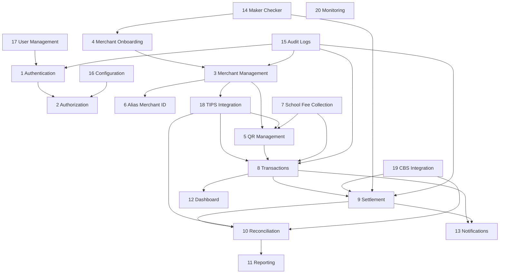

# MMS Module Breakdown
# Complete Specification per Module

| Field | Value |
|-------|-------|
| **Version** | 1.0 |
| **Date** | 4 June 2026 |
| **Derived from** | `Docs/BRD-Merchant-Management-System.md`, `Architecture/Enterprise-System-Architecture.md` |
| **NestJS mapping** | One bounded context per row; may share `Backend/src/modules/*` |

---

## Module dependency map

---

## Global conventions

### API standards

| Convention | Rule |
|------------|------|
| Base path | `/api/v1` |
| Auth | `Authorization: Bearer {accessToken}` except public/webhook routes |
| Idempotency | `Idempotency-Key` header on POST that create money records |
| Correlation | `X-Correlation-Id` on all requests |
| Pagination | `?page=&limit=` cursor-based for transactions |
| Errors | RFC 7807 Problem Details |

### Permission naming

Format: `{module}:{action}` — enforced by Authorization module guards.

### Shared user roles (reference)

| Role | Code |
|------|------|
| Super Admin | `SUPER_ADMIN` |
| Acquirer Admin | `ACQUIRER_ADMIN` |
| Compliance Officer | `COMPLIANCE` |
| Operations Manager | `OPS_MANAGER` |
| Operations Analyst | `OPS_ANALYST` |
| Finance Officer | `FINANCE` |
| Risk Manager | `RISK` |
| Support Agent | `SUPPORT` |
| Merchant Admin | `MERCHANT_ADMIN` |
| Merchant Cashier | `MERCHANT_CASHIER` |
| School Bursar | `SCHOOL_BURSAR` |
| School Admin | `SCHOOL_ADMIN` |
| API Integrator | `API_INTEGRATOR` |
| Auditor | `AUDITOR` |

---

# Module 1 — Authentication

## Purpose

Establish and maintain **trusted identity** for all human and machine users accessing MMS. Issue short-lived JWT access tokens and rotatable refresh tokens; support MFA for privileged roles.

## Features

| ID | Feature |
|----|---------|
| F1.1 | Email/username + password login |
| F1.2 | JWT access token issuance (configurable TTL, default 15 min) |
| F1.3 | Refresh token rotation with reuse detection |
| F1.4 | MFA (TOTP) for admin, finance, compliance roles |
| F1.5 | Account lockout after failed attempts |
| F1.6 | Password reset via secure token (email) |
| F1.7 | Session invalidation (logout all devices) |
| F1.8 | API client credentials for integrators (client_id / secret) |
| F1.9 | Optional SSO/SAML hook [future] |

## Database tables

| Table | Description |
|-------|-------------|
| `auth_credentials` | password_hash, mfa_secret_enc, lockout_until |
| `refresh_tokens` | token_hash, user_id, expires_at, revoked_at, family_id |
| `login_attempts` | username, ip, success, created_at |
| `api_clients` | client_id, secret_hash, integrator_merchant_id |
| `password_reset_tokens` | token_hash, user_id, expires_at |

*Note: Core `users` table owned by **User Management** module.*

## APIs

| Method | Endpoint | Description | Auth |
|--------|----------|-------------|------|
| POST | `/auth/login` | Login; returns access + sets refresh cookie | Public |
| POST | `/auth/refresh` | Rotate tokens | Refresh cookie |
| POST | `/auth/logout` | Revoke refresh token | Bearer |
| POST | `/auth/logout-all` | Revoke all sessions | Bearer |
| POST | `/auth/mfa/setup` | Enroll TOTP | Bearer |
| POST | `/auth/mfa/verify` | Verify MFA at login | Public (step-up) |
| POST | `/auth/password/forgot` | Request reset | Public |
| POST | `/auth/password/reset` | Complete reset | Public (token) |
| POST | `/auth/token/client` | Client credentials grant | Basic client auth |

## User roles

| Role | Access |
|------|--------|
| All internal/merchant users | Login, refresh, logout, MFA (if required) |
| API Integrator | Client credentials only |
| Public | Forgot/reset password only |

## Permissions

| Permission | Description |
|------------|-------------|
| `auth:login` | Implicit (public endpoint) |
| `auth:mfa:manage` | Setup MFA on own account |
| `auth:session:revoke-all` | Logout all devices (self or admin) |
| `auth:client:manage` | Manage API clients (integrator admin) |

## Acceptance criteria

| ID | Criteria |
|----|----------|
| AC-1.1 | Valid credentials return JWT within 500ms (p95) |
| AC-1.2 | Expired access token rejected with 401; refresh succeeds with valid refresh token |
| AC-1.3 | Reused refresh token revokes entire token family |
| AC-1.4 | After 5 failed logins, account locked for configurable duration |
| AC-1.5 | MFA mandatory roles cannot access protected routes without MFA verification |
| AC-1.6 | All auth events written to Audit Logs with correlation ID |
| AC-1.7 | Passwords stored with bcrypt/argon2; never logged |
| AC-1.8 | Refresh token stored only as hash; httpOnly Secure cookie for browser clients |

---

# Module 2 — Authorization

## Purpose

Enforce **RBAC** across all APIs and UI routes. Map users to roles and roles to fine-grained permissions; support acquirer-scoped and merchant-scoped data isolation.

## Features

| ID | Feature |
|----|---------|
| F2.1 | Role definitions (system + custom) |
| F2.2 | Permission catalog per module |
| F2.3 | Role-permission assignment UI/API |
| F2.4 | JWT claims embed roles + permissions (or role only + server lookup) |
| F2.5 | NestJS guards: `PermissionsGuard`, `RolesGuard` |
| F2.6 | Resource-level scoping (merchant_id, store_id in claims) |
| F2.7 | Deny-by-default policy |
| F2.8 | Permission cache in Redis (TTL 5 min) |

## Database tables

| Table | Description |
|-------|-------------|
| `roles` | code, name, is_system, acquirer_id |
| `permissions` | code, module, description |
| `role_permissions` | role_id, permission_id |
| `user_roles` | user_id, role_id, scope_type, scope_id |
| `policy_overrides` | user_id, permission_id, effect ALLOW/DENY [optional] |

## APIs

| Method | Endpoint | Description |
|--------|----------|-------------|
| GET | `/authz/roles` | List roles |
| POST | `/authz/roles` | Create custom role |
| PUT | `/authz/roles/{id}` | Update role |
| GET | `/authz/permissions` | List permission catalog |
| PUT | `/authz/roles/{id}/permissions` | Assign permissions |
| GET | `/authz/users/{userId}/effective-permissions` | Debug effective perms |
| GET | `/authz/me/permissions` | Current user permissions |

## User roles

| Role | Access |
|------|--------|
| Super Admin | Full authz management |
| Acquirer Admin | Manage roles below super level |
| Auditor | Read-only role/permission view |
| Others | `authz:me` only |

## Permissions

| Permission | Description |
|------------|-------------|
| `authz:role:read` | View roles |
| `authz:role:write` | Create/update roles |
| `authz:permission:read` | View permission catalog |
| `authz:user-role:assign` | Assign roles to users |

## Acceptance criteria

| ID | Criteria |
|----|----------|
| AC-2.1 | User without permission receives 403 on protected endpoint |
| AC-2.2 | Merchant Admin cannot access another merchant's data |
| AC-2.3 | Permission changes take effect within cache TTL or immediate on revoke |
| AC-2.4 | System roles cannot be deleted |
| AC-2.5 | All role changes audited |

---

# Module 3 — Merchant Management

## Purpose

Maintain the **golden record** for enrolled merchants: legal profile, outlets, terminals, settlement accounts, risk limits, and lifecycle status after onboarding is complete.

## Features

| ID | Feature |
|----|---------|
| F3.1 | Merchant CRUD (post-approval) |
| F3.2 | Multi-store and multi-terminal hierarchy |
| F3.3 | MCC, trading name, TANQR display fields (name, city, postcode TZ) |
| F3.4 | Settlement account linkage |
| F3.5 | Transaction limits and velocity rules |
| F3.6 | Suspend / reactivate / close merchant |
| F3.7 | Merchant search and filters |
| F3.8 | Merchant self-service profile update (limited fields) |
| F3.9 | Document attachments (KYC refs) |
| F3.10 | Risk score display and override workflow |

## Database tables

| Table | Description |
|-------|-------------|
| `merchants` | legal_name, trading_name, status, mcc, acquirer_id |
| `merchant_profiles` | city, postal_code, country, address, contact |
| `stores` | merchant_id, store_label, name, address |
| `terminals` | store_id, terminal_label, status |
| `settlement_accounts` | merchant_id, account_no, bank_code, verified_at |
| `merchant_limits` | daily_limit, txn_max, velocity_count |
| `merchant_risk_scores` | score, factors_json, assessed_at |
| `merchant_documents` | s3_key, doc_type, merchant_id |

## APIs

| Method | Endpoint | Description |
|--------|----------|-------------|
| GET | `/merchants` | List/search merchants |
| GET | `/merchants/{id}` | Merchant detail |
| PUT | `/merchants/{id}` | Update profile |
| POST | `/merchants/{id}/suspend` | Suspend |
| POST | `/merchants/{id}/reactivate` | Reactivate |
| POST | `/merchants/{id}/close` | Close |
| GET | `/merchants/{id}/stores` | List stores |
| POST | `/merchants/{id}/stores` | Add store |
| PUT | `/stores/{id}` | Update store |
| GET | `/stores/{id}/terminals` | List terminals |
| POST | `/stores/{id}/terminals` | Add terminal |
| PUT | `/merchants/{id}/limits` | Update limits |
| GET | `/merchants/{id}/documents` | List documents |

## User roles

| Role | Access |
|------|--------|
| Acquirer Admin, Ops Manager | Full manage |
| Compliance, Risk | Read + suspend |
| Support | Read only |
| Merchant Admin | Own merchant read/update (scoped) |
| Merchant Cashier | Read store/terminal (scoped) |
| Auditor | Read only |

## Permissions

| Permission | Description |
|------------|-------------|
| `merchant:read` | View merchants |
| `merchant:write` | Update merchant profile |
| `merchant:suspend` | Suspend/reactivate |
| `merchant:close` | Close merchant |
| `merchant:store:write` | Manage stores/terminals |
| `merchant:limits:write` | Set limits |
| `merchant:self:read` | Merchant portal read own |
| `merchant:self:write` | Merchant portal limited write |

## Acceptance criteria

| ID | Criteria |
|----|----------|
| AC-3.1 | Merchant record includes all mandatory TANQR fields (59, 60, 61, 52, 58) |
| AC-3.2 | Suspend blocks new QR generation and flags payments for review |
| AC-3.3 | Merchant Admin sees only own `merchant_id` |
| AC-3.4 | Store Label and Terminal Label map to TANQR ID 62 sub-tags |
| AC-3.5 | All status changes create audit entries |

---

# Module 4 — Merchant Onboarding

## Purpose

Manage **end-to-end merchant acquisition**: application intake, KYC collection, compliance review, risk approval, and handoff to TIPS registration and QR issuance.

## Features

| ID | Feature |
|----|---------|
| F4.1 | Onboarding application form (multi-step) |
| F4.2 | KYC document upload (ID, license, TIN) |
| F4.3 | Beneficial owner capture |
| F4.4 | AML screening integration hook |
| F4.5 | Compliance review queue |
| F4.6 | Risk approval workflow |
| F4.7 | Maker-checker for approval (see Module 14) |
| F4.8 | CBS settlement account verification |
| F4.9 | Onboarding SLA tracking |
| F4.10 | Bulk onboarding import |
| F4.11 | Rejection with reason codes |
| F4.12 | Auto-trigger TIPS + QR on final approval |

## Database tables

| Table | Description |
|-------|-------------|
| `onboarding_applications` | status, submitted_at, merchant_id nullable |
| `onboarding_steps` | application_id, step, completed_at |
| `kyc_submissions` | application_id, document refs |
| `kyc_reviews` | reviewer_id, decision, notes |
| `beneficial_owners` | application_id, name, id_number_enc |
| `aml_screening_results` | application_id, provider_ref, result |
| `onboarding_rejection_reasons` | code, description |

## APIs

| Method | Endpoint | Description |
|--------|----------|-------------|
| POST | `/onboarding/applications` | Submit application |
| GET | `/onboarding/applications` | Queue list |
| GET | `/onboarding/applications/{id}` | Detail |
| PUT | `/onboarding/applications/{id}` | Update draft |
| POST | `/onboarding/applications/{id}/documents` | Upload KYC |
| POST | `/onboarding/applications/{id}/submit` | Submit for review |
| POST | `/onboarding/applications/{id}/aml-screen` | Trigger AML |
| POST | `/onboarding/applications/{id}/approve` | Compliance approve (maker) |
| POST | `/onboarding/applications/{id}/reject` | Reject |
| GET | `/onboarding/applications/{id}/timeline` | Status history |

## User roles

| Role | Access |
|------|--------|
| Acquirer Admin, Ops Manager | Create/view applications |
| Compliance | Review, approve/reject (maker) |
| Finance | Verify settlement account |
| Risk | Risk sign-off |
| Support | View only |
| Merchant (external) | Submit own application [optional portal] |

## Permissions

| Permission | Description |
|------------|-------------|
| `onboarding:read` | View applications |
| `onboarding:write` | Create/edit applications |
| `onboarding:submit` | Submit for review |
| `onboarding:kyc:review` | Compliance review |
| `onboarding:approve` | Maker approve |
| `onboarding:reject` | Reject application |
| `onboarding:aml:trigger` | Run AML screen |

## Acceptance criteria

| ID | Criteria |
|----|----------|
| AC-4.1 | Cannot approve without all mandatory KYC documents |
| AC-4.2 | Approval requires maker-checker when enabled |
| AC-4.3 | On approval, merchant status = ACTIVE and TIPS registration job queued |
| AC-4.4 | CBS account verification must pass before approval |
| AC-4.5 | Rejected applications cannot accept payments |
| AC-4.6 | Complete audit trail of reviewers and timestamps |

---

# Module 5 — QR Management

## Purpose

Generate, validate, render, and lifecycle-manage **TANQR-compliant** static and dynamic QR codes per BoT Standard 2022 (EMV TLV, CRC, Annex 2 layout).

## Features

| ID | Feature |
|----|---------|
| F5.1 | Static QR generation (POI 11) |
| F5.2 | Dynamic QR per amount/invoice (POI 12) |
| F5.3 | TIPS ID 26 embedding (`tz.go.bot.tips`, acquirer ID, merchant ID) |
| F5.4 | CRC16 validation (ISO/IEC 13239) |
| F5.5 | Annex 2 layout render (PNG/PDF) |
| F5.6 | Bill number / reference in ID 62 |
| F5.7 | QR regeneration on merchant change |
| F5.8 | QR revocation |
| F5.9 | Legacy QR migration mapping |
| F5.10 | Payload validation API |
| F5.11 | Batch QR print export |
| F5.12 | Tip/convenience fee fields (ID 55–57) optional |

## Database tables

| Table | Description |
|-------|-------------|
| `qr_codes` | merchant_id, type STATIC/DYNAMIC, status, payload |
| `qr_payload_versions` | qr_id, version, tlv_payload, crc |
| `qr_render_assets` | qr_id, s3_key, format, annex2_layout_version |
| `qr_templates` | acquirer branding defaults |
| `mcc_reference` | code, description (read-only ref) |
| `postcode_reference` | tcrA 5-digit codes |

## APIs

| Method | Endpoint | Description |
|--------|----------|-------------|
| POST | `/qr/static` | Generate static QR |
| POST | `/qr/dynamic` | Generate dynamic QR |
| GET | `/qr/{id}` | QR detail + download URL |
| GET | `/merchants/{id}/qr` | List merchant QRs |
| POST | `/qr/{id}/revoke` | Revoke QR |
| POST | `/qr/{id}/regenerate` | Regenerate |
| POST | `/qr/validate` | Validate payload string |
| GET | `/qr/{id}/download` | Presigned S3 URL |
| POST | `/qr/batch-print` | Batch PDF |
| POST | `/qr/migrate` | Legacy → TANQR mapping |

## User roles

| Role | Access |
|------|--------|
| Ops Manager, Acquirer Admin | Full QR ops |
| Merchant Admin | Generate/download own QR |
| Merchant Cashier | Download/print store QR |
| School Bursar | Dynamic QR per invoice |
| Support | Read only |

## Permissions

| Permission | Description |
|------------|-------------|
| `qr:read` | View QR |
| `qr:generate` | Create static/dynamic |
| `qr:revoke` | Revoke QR |
| `qr:regenerate` | Regenerate |
| `qr:validate` | Validate payload |
| `qr:self:download` | Merchant download own |

## Acceptance criteria

| ID | Criteria |
|----|----------|
| AC-5.1 | Every issued QR passes CRC validation before persist |
| AC-5.2 | Static uses POI `11`; dynamic uses `12` with amount ID 54 |
| AC-5.3 | Currency always `834`; country `TZ` |
| AC-5.4 | ID 26 matches TIPS registration record |
| AC-5.5 | Rendered PDF meets Annex 2 layout (Parts A–D) |
| AC-5.6 | Revoked QR rejected if scanned (status check at payment match) |
| AC-5.7 | Dynamic QR links to invoice when school/merchant context provided |

---

# Module 6 — Alias Merchant ID (Lipa Namba)

## Purpose

Manage **8-digit Lipa Namba aliases** for feature-phone/USSD payments: acquirer code + merchant code + **Damm checksum**; sync with TANQR ID 62 store/terminal labels.

## Features

| ID | Feature |
|----|---------|
| F6.1 | Auto-generate alias on TIPS registration |
| F6.2 | Damm checksum calculation and validation |
| F6.3 | Map 15-digit TIPS merchant ID ↔ 4-digit merchant code |
| F6.4 | Display alias on QR Part C (Annex 2) |
| F6.5 | Alias uniqueness per acquirer |
| F6.6 | Additional acquirer code blocks |
| F6.7 | Alias lookup API for internal resolution |
| F6.8 | Alias deactivation on merchant suspend |

## Database tables

| Table | Description |
|-------|-------------|
| `merchant_aliases` | merchant_id, alias_8digit, acquirer_code_3, merchant_code_4, checksum_1 |
| `alias_generation_log` | merchant_id, generated_at, algorithm_version |
| `acquirer_code_blocks` | acquirer_id, block_start, block_end, used_count |

## APIs

| Method | Endpoint | Description |
|--------|----------|-------------|
| GET | `/merchants/{id}/alias` | Get Lipa Namba |
| POST | `/merchants/{id}/alias/regenerate` | Regenerate (ops only) |
| POST | `/alias/validate` | Validate checksum |
| GET | `/alias/lookup/{alias}` | Resolve to merchant (internal) |

## User roles

| Role | Access |
|------|--------|
| Ops Manager, Acquirer Admin | Manage/regenerate |
| Merchant Admin | View own alias |
| Support | Lookup (read) |
| System (TIPS webhook) | Internal lookup |

## Permissions

| Permission | Description |
|------------|-------------|
| `alias:read` | View alias |
| `alias:regenerate` | Force regenerate |
| `alias:lookup` | Internal resolve |
| `alias:validate` | Validate checksum |

## Acceptance criteria

| ID | Criteria |
|----|----------|
| AC-6.1 | Alias always 8 numeric digits |
| AC-6.2 | Damm checksum validates per TIPS Annex 3 |
| AC-6.3 | Alias unique within acquirer |
| AC-6.4 | Payment webhook resolves alias to correct merchant |
| AC-6.5 | Alias printed on QR Part C with merchant name |

---

# Module 7 — School Fee Collection

## Purpose

Vertical module for **education merchants**: academic structure, student registry, fee invoicing, dynamic TANQR per bill, payment allocation, and bursar reporting.

## Features

| ID | Feature |
|----|---------|
| F7.1 | School profile (extends merchant) |
| F7.2 | Academic year and term management |
| F7.3 | Fee item catalog |
| F7.4 | Student registry |
| F7.5 | Invoice generation with unique bill number |
| F7.6 | Bulk invoice generation |
| F7.7 | Dynamic QR per invoice |
| F7.8 | Payment allocation (full/partial/overpay) |
| F7.9 | Guardian SMS/email receipt |
| F7.10 | Student statements |
| F7.11 | Collections dashboard by class/term |
| F7.12 | Discounts/scholarships |
| F7.13 | GePG control number hook [future] |
| F7.14 | School MIS API import |

## Database tables

| Table | Description |
|-------|-------------|
| `schools` | merchant_id, registration_no, head_name |
| `academic_years` | school_id, name, start_date, end_date |
| `terms` | academic_year_id, name, due_date |
| `fee_items` | school_id, code, name, amount, mandatory |
| `classes` | school_id, name, level |
| `students` | school_id, admission_no, name, class_id, guardian_phone_enc |
| `invoices` | student_id, term_id, bill_number, total, status |
| `invoice_lines` | invoice_id, fee_item_id, amount |
| `payment_allocations` | payment_id, invoice_id, amount |
| `student_balances` | student_id, balance, updated_at |

## APIs

| Method | Endpoint | Description |
|--------|----------|-------------|
| GET | `/schools/{merchantId}` | School profile |
| PUT | `/schools/{merchantId}` | Update school |
| CRUD | `/schools/{id}/academic-years` | Academic years |
| CRUD | `/schools/{id}/terms` | Terms |
| CRUD | `/schools/{id}/fee-items` | Fee catalog |
| CRUD | `/schools/{id}/students` | Students |
| POST | `/schools/{id}/invoices` | Create invoice |
| POST | `/schools/{id}/invoices/bulk` | Bulk generate |
| GET | `/invoices/{id}` | Invoice detail |
| POST | `/invoices/{id}/qr` | Generate dynamic QR |
| GET | `/schools/{id}/collections` | Collections summary |
| GET | `/students/{id}/statement` | Payment history |
| POST | `/invoices/{id}/allocate` | Manual allocation [ops] |

## User roles

| Role | Access |
|------|--------|
| School Bursar | Full school fee ops (scoped school) |
| School Admin | Reports + user mgmt within school |
| Merchant Admin | If school merchant, same scope |
| Ops Manager | Support escalations |
| Compliance | Read only |

## Permissions

| Permission | Description |
|------------|-------------|
| `school:read` | View school data |
| `school:write` | Manage structure/fees |
| `school:student:write` | Manage students |
| `school:invoice:write` | Create invoices |
| `school:invoice:qr` | Generate fee QR |
| `school:report:read` | Collections reports |
| `school:statement:read` | Student statements |

## Acceptance criteria

| ID | Criteria |
|----|----------|
| AC-7.1 | Bill number unique per school |
| AC-7.2 | Dynamic QR amount matches invoice total |
| AC-7.3 | Payment auto-allocates to invoice via bill reference |
| AC-7.4 | Partial payment updates invoice to PARTIAL |
| AC-7.5 | Guardian receipt sent within 60s of payment |
| AC-7.6 | No full student PII on printed QR (bill ref only) |
| AC-7.7 | Collections report matches payments ledger |

---

# Module 8 — Transactions

## Purpose

Ingest, store, match, and expose **payment transactions** from TIPS (and related channels); enforce idempotency; support refunds/reversals linkage.

## Features

| ID | Feature |
|----|---------|
| F8.1 | TIPS payment webhook ingestion |
| F8.2 | Idempotency by `tips_end_to_end_id` |
| F8.3 | Match to merchant, store, terminal, invoice |
| F8.4 | Transaction lifecycle states |
| F8.5 | Real-time merchant notifications trigger |
| F8.6 | Transaction search and export |
| F8.7 | Refund/reversal initiation |
| F8.8 | Payment event timeline |
| F8.9 | Large transaction AML flag |
| F8.10 | Public API for integrators (scoped) |

## Database tables

| Table | Description |
|-------|-------------|
| `payments` | tips_e2e_id, merchant_id, amount, currency, status, channel |
| `payment_events` | payment_id, event_type, payload_json, created_at |
| `idempotency_keys` | key, response_hash, expires_at |
| `payment_metadata` | payment_id, bill_number, reference, qr_id, alias_used |
| `refunds` | payment_id, amount, status, tips_reversal_ref |

## APIs

| Method | Endpoint | Description |
|--------|----------|-------------|
| POST | `/webhooks/tips/payment` | TIPS notification (mTLS/HMAC) |
| GET | `/transactions` | Search/list |
| GET | `/transactions/{id}` | Detail |
| GET | `/transactions/{id}/events` | Event timeline |
| POST | `/transactions/{id}/refund` | Initiate refund |
| GET | `/merchants/{id}/transactions` | Merchant-scoped list |
| POST | `/transactions/export` | Async CSV export |

## User roles

| Role | Access |
|------|--------|
| Ops Manager, Ops Analyst | Full search |
| Finance | Read + export |
| Merchant Admin/Cashier | Own merchant txns |
| School Bursar | School-related txns |
| Support | Read only |
| API Integrator | Scoped read via API key |
| TIPS (system) | Webhook only |

## Permissions

| Permission | Description |
|------------|-------------|
| `transaction:read` | View transactions |
| `transaction:export` | Export |
| `transaction:refund` | Initiate refund |
| `transaction:webhook` | System (TIPS) |
| `transaction:self:read` | Merchant own |

## Acceptance criteria

| ID | Criteria |
|----|----------|
| AC-8.1 | Duplicate TIPS e2e ID returns 200 without double post |
| AC-8.2 | Payment matched to merchant within 1s of ingest |
| AC-8.3 | Notification queued within 3s (NFR) |
| AC-8.4 | Refund updates status and calls TIPS reversal |
| AC-8.5 | All state transitions in `payment_events` |
| AC-8.6 | Webhook rejects invalid signature |

---

# Module 9 — Settlement

## Purpose

Aggregate successful payments into **settlement batches**, apply fees (MDR, TIPS), obtain maker-checker approval, and post net amounts to merchant CBS accounts.

## Features

| ID | Feature |
|----|---------|
| F9.1 | Settlement calendar (T+0/T+1) |
| F9.2 | Auto batch creation at cut-off |
| F9.3 | Fee calculation engine |
| F9.4 | Maker-checker approval |
| F9.5 | CBS posting via integration |
| F9.6 | Partial failure retry |
| F9.7 | Merchant settlement advice |
| F9.8 | GL export entries |
| F9.9 | Settlement batch reports |

## Database tables

| Table | Description |
|-------|-------------|
| `settlement_batches` | batch_no, status, cut_off_at, approved_at |
| `settlement_lines` | batch_id, payment_id, gross, fees, net |
| `fee_rules` | acquirer_id, mcc, mdr_pct, fixed_fee |
| `cbs_postings` | settlement_line_id, cbs_ref, status, posted_at |
| `settlement_approvals` | batch_id, maker_id, checker_id, decision |

## APIs

| Method | Endpoint | Description |
|--------|----------|-------------|
| GET | `/settlements/batches` | List batches |
| GET | `/settlements/batches/{id}` | Batch detail |
| POST | `/settlements/batches/generate` | Manual trigger |
| POST | `/settlements/batches/{id}/submit` | Submit for approval |
| POST | `/settlements/batches/{id}/approve` | Checker approve |
| POST | `/settlements/batches/{id}/reject` | Reject |
| POST | `/settlements/batches/{id}/post` | Trigger CBS posting |
| GET | `/settlements/batches/{id}/lines` | Line items |
| GET | `/merchants/{id}/settlements` | Merchant history |

## User roles

| Role | Access |
|------|--------|
| Finance Officer | Full settlement ops |
| Ops Manager | View + submit |
| Acquirer Admin | Approve (checker) |
| Merchant Admin | View own advices |
| Auditor | Read only |

## Permissions

| Permission | Description |
|------------|-------------|
| `settlement:read` | View batches |
| `settlement:generate` | Create batches |
| `settlement:submit` | Submit for approval |
| `settlement:approve` | Checker approve |
| `settlement:post` | Trigger CBS post |
| `settlement:self:read` | Merchant view own |

## Acceptance criteria

| ID | Criteria |
|----|----------|
| AC-9.1 | Batch includes only SUCCESS payments in cut-off window |
| AC-9.2 | Net = gross − MDR − switch fees (configurable) |
| AC-9.3 | Cannot post without checker approval when MC enabled |
| AC-9.4 | CBS success stores `cbs_ref`; failure goes to exception queue |
| AC-9.5 | Merchant advice generated on POSTED |
| AC-9.6 | Idempotent CBS posting per settlement line |

---

# Module 10 — Reconciliation

## Purpose

Perform **three-way reconciliation** (MMS ledger vs TIPS reports vs CBS statements); manage exceptions through resolution workflow.

## Features

| ID | Feature |
|----|---------|
| F10.1 | Scheduled daily recon runs |
| F10.2 | TIPS settlement file ingestion |
| F10.3 | CBS EOD statement ingestion |
| F10.4 | Auto-match on e2e ID, amount, date |
| F10.5 | Exception classification |
| F10.6 | Ops resolution workflow |
| F10.7 | Recon run reports |
| F10.8 | Escalation to compliance |

## Database tables

| Table | Description |
|-------|-------------|
| `recon_runs` | run_date, status, started_at, closed_at |
| `recon_sources` | run_id, source MMS/TIPS/CBS, record_count |
| `recon_matches` | run_id, payment_id, match_type |
| `recon_exceptions` | run_id, type, amount, status, assigned_to |
| `recon_resolutions` | exception_id, action, resolver_id, notes |

## APIs

| Method | Endpoint | Description |
|--------|----------|-------------|
| GET | `/reconciliation/runs` | List runs |
| GET | `/reconciliation/runs/{id}` | Run detail |
| POST | `/reconciliation/runs` | Manual start |
| GET | `/reconciliation/runs/{id}/exceptions` | Exceptions |
| PUT | `/reconciliation/exceptions/{id}` | Update/resolve |
| POST | `/reconciliation/runs/{id}/close` | Close run |
| GET | `/reconciliation/exceptions/export` | Export |

## User roles

| Role | Access |
|------|--------|
| Finance Officer | Full recon |
| Ops Analyst | Resolve exceptions |
| Ops Manager | Oversight |
| Auditor | Read only |

## Permissions

| Permission | Description |
|------------|-------------|
| `recon:read` | View runs |
| `recon:run` | Start recon |
| `recon:exception:resolve` | Resolve breaks |
| `recon:close` | Close run |

## Acceptance criteria

| ID | Criteria |
|----|----------|
| AC-10.1 | Daily run completes within 2h of CBS EOD availability |
| AC-10.2 | Match rate ≥ 99% on stable day (target) |
| AC-10.3 | Each exception has type, amount, age, assignee |
| AC-10.4 | Resolved exceptions retain audit trail |
| AC-10.5 | Cannot close run with open critical exceptions without override |

---

# Module 11 — Reporting

## Purpose

Generate **operational, merchant, school, and regulatory** reports; schedule delivery; integrate with Metabase for BI.

## Features

| ID | Feature |
|----|---------|
| F11.1 | Report catalog (predefined) |
| F11.2 | On-demand report generation |
| F11.3 | Scheduled reports (email) |
| F11.4 | Export CSV/Excel/PDF |
| F11.5 | Regulatory BoT reports |
| F11.6 | TANQR adoption report |
| F11.7 | AML large transaction report |
| F11.8 | Metabase embedding/links |
| F11.9 | Async report jobs (RabbitMQ) |

## Database tables

| Table | Description |
|-------|-------------|
| `report_definitions` | code, name, query_template, params |
| `report_jobs` | definition_id, status, requested_by, s3_output_key |
| `report_schedules` | definition_id, cron, recipients |
| `report_execution_log` | job_id, rows, duration_ms |

## APIs

| Method | Endpoint | Description |
|--------|----------|-------------|
| GET | `/reports/definitions` | Catalog |
| POST | `/reports/generate` | Start job |
| GET | `/reports/jobs/{id}` | Job status |
| GET | `/reports/jobs/{id}/download` | Download output |
| CRUD | `/reports/schedules` | Manage schedules |
| GET | `/reports/regulatory/{type}` | Regulatory preset |

## User roles

| Role | Access |
|------|--------|
| Finance, Compliance, Ops Manager | Full reports |
| Acquirer Admin | All |
| Merchant Admin | Merchant-scoped reports |
| School Admin | School reports |
| Auditor | Read/download |
| BoT Examiner | Regulatory read-only [PRJ] |

## Permissions

| Permission | Description |
|------------|-------------|
| `report:read` | View/run reports |
| `report:schedule:write` | Manage schedules |
| `report:regulatory` | Regulatory exports |
| `report:merchant:self` | Own merchant reports |

## Acceptance criteria

| ID | Criteria |
|----|----------|
| AC-11.1 | Reports use read replica; no impact on OLTP |
| AC-11.2 | Large reports run async; user notified on completion |
| AC-11.3 | Regulatory report figures match transaction ledger |
| AC-11.4 | Row-level security by acquirer/merchant |
| AC-11.5 | Outputs retained per retention policy |

---

# Module 12 — Dashboard

## Purpose

Provide **role-based real-time KPIs** and widgets in Next.js: transaction volumes, merchant growth, settlement status, recon breaks, school collections.

## Features

| ID | Feature |
|----|---------|
| F12.1 | Acquirer executive dashboard |
| F12.2 | Operations dashboard |
| F12.3 | Finance dashboard |
| F12.4 | Merchant dashboard |
| F12.5 | School bursar dashboard |
| F12.6 | Configurable widget layout [optional] |
| F12.7 | Date range filters |
| F12.8 | Drill-down to transactions |

## Database tables

| Table | Description |
|-------|-------------|
| `dashboard_widgets` | role, widget_key, config_json |
| `dashboard_snapshots` | widget_key, date, metrics_json (cache) |

*Primary metrics computed from `payments`, `merchants`, `settlement_batches`, `recon_exceptions`.*

## APIs

| Method | Endpoint | Description |
|--------|----------|-------------|
| GET | `/dashboard/acquirer` | Acquirer KPIs |
| GET | `/dashboard/operations` | Ops KPIs |
| GET | `/dashboard/finance` | Finance KPIs |
| GET | `/dashboard/merchant` | Merchant-scoped KPIs |
| GET | `/dashboard/school` | School collections KPIs |
| GET | `/dashboard/widgets` | User widget config |

## User roles

| Role | Dashboard |
|------|-----------|
| Acquirer Admin | Acquirer |
| Ops Manager/Analyst | Operations |
| Finance | Finance |
| Merchant Admin | Merchant |
| School Bursar/Admin | School |
| Risk/Compliance | Acquirer (limited widgets) |

## Permissions

| Permission | Description |
|------------|-------------|
| `dashboard:acquirer` | Acquirer view |
| `dashboard:ops` | Operations view |
| `dashboard:finance` | Finance view |
| `dashboard:merchant` | Merchant view |
| `dashboard:school` | School view |

## Acceptance criteria

| ID | Criteria |
|----|----------|
| AC-12.1 | KPI data refreshed ≤ 5 min (cache) or real-time for critical |
| AC-12.2 | Merchant dashboard shows only scoped merchant data |
| AC-12.3 | Page load ≤ 3s for dashboard API aggregate |
| AC-12.4 | Drill-down links respect authorization |

---

# Module 13 — Notifications

## Purpose

Deliver **SMS, email, and in-app** notifications for payments, settlements, onboarding, and school receipts via async workers.

## Features

| ID | Feature |
|----|---------|
| F13.1 | Template management |
| F13.2 | SMS via gateway |
| F13.3 | Email via SES/SMTP |
| F13.4 | In-app notification inbox |
| F13.5 | Event-driven triggers (RabbitMQ) |
| F13.6 | Delivery status tracking |
| F13.7 | Retry and DLQ |
| F13.8 | Opt-out / consent flags |

## Database tables

| Table | Description |
|-------|-------------|
| `notification_templates` | code, channel, body_template, lang |
| `notification_log` | recipient, channel, status, sent_at, correlation_id |
| `notification_preferences` | user_id/merchant_id, channel, enabled |
| `in_app_notifications` | user_id, title, body, read_at |

## APIs

| Method | Endpoint | Description |
|--------|----------|-------------|
| GET | `/notifications/templates` | List templates |
| PUT | `/notifications/templates/{code}` | Update template |
| GET | `/notifications/log` | Delivery log |
| GET | `/notifications/in-app` | User inbox |
| PUT | `/notifications/in-app/{id}/read` | Mark read |
| PUT | `/notifications/preferences` | Update prefs |

## User roles

| Role | Access |
|------|--------|
| Acquirer Admin | Template management |
| All users | In-app + preferences (self) |
| Ops | View logs |
| System | Internal publish only |

## Permissions

| Permission | Description |
|------------|-------------|
| `notification:template:write` | Edit templates |
| `notification:log:read` | View delivery log |
| `notification:self:read` | In-app own |
| `notification:preferences:write` | Own prefs |

## Acceptance criteria

| ID | Criteria |
|----|----------|
| AC-13.1 | Payment notification sent within 60s (NFR target 5s queue) |
| AC-13.2 | Failed SMS retries 3x then DLQ |
| AC-13.3 | Templates support EN/SW variables |
| AC-13.4 | All sends logged with correlation ID |
| AC-13.5 | No PII in SMS beyond policy limits |

---

# Module 14 — Maker Checker Workflow

## Purpose

Enforce **segregation of duties** for high-risk actions: merchant approval, settlement posting, fee rule changes, limit overrides.

## Features

| ID | Feature |
|----|---------|
| F14.1 | Configurable MC rules per entity type |
| F14.2 | Maker submits; checker approves/rejects |
| F14.3 | Same user cannot be checker of own request |
| F14.4 | Approval task inbox |
| F14.5 | Expiry of pending approvals |
| F14.6 | Emergency override (super admin + audit) |

## Database tables

| Table | Description |
|-------|-------------|
| `approval_policies` | entity_type, enabled, sla_hours |
| `approval_tasks` | entity_type, entity_id, maker_id, status |
| `approval_decisions` | task_id, checker_id, decision, notes |

## APIs

| Method | Endpoint | Description |
|--------|----------|-------------|
| GET | `/approvals/tasks` | My inbox (checker) |
| GET | `/approvals/tasks/{id}` | Task detail |
| POST | `/approvals/tasks/{id}/approve` | Approve |
| POST | `/approvals/tasks/{id}/reject` | Reject |
| GET | `/approvals/policies` | List policies |
| PUT | `/approvals/policies/{entityType}` | Configure |

## User roles

| Role | Typical involvement |
|------|---------------------|
| Compliance, Ops | Maker (onboarding) |
| Acquirer Admin, Finance | Checker |
| Super Admin | Policy config + override |

## Permissions

| Permission | Description |
|------------|-------------|
| `approval:task:read` | View tasks |
| `approval:task:approve` | Checker approve |
| `approval:task:reject` | Checker reject |
| `approval:policy:write` | Configure policies |
| `approval:override` | Emergency override |

## Acceptance criteria

| ID | Criteria |
|----|----------|
| AC-14.1 | Maker cannot approve own task |
| AC-14.2 | Settlement post blocked until checker approval |
| AC-14.3 | All decisions immutably audited |
| AC-14.4 | Pending tasks visible in checker inbox |
| AC-14.5 | Override requires reason code + super admin |

---

# Module 15 — Audit Logs

## Purpose

Maintain **immutable, append-only** audit trail for compliance, BoT examination, and forensic investigation.

## Features

| ID | Feature |
|----|---------|
| F15.1 | Auto-capture on all write operations |
| F15.2 | Actor, action, entity, before/after snapshot |
| F15.3 | Correlation ID linkage |
| F15.4 | Search and filter |
| F15.5 | Export for auditors |
| F15.6 | Tamper-evident storage (no UPDATE/DELETE) |
| F15.7 | Retention ≥ 7 years |

## Database tables

| Table | Description |
|-------|-------------|
| `audit_logs` | id, actor_id, action, entity_type, entity_id, old_json, new_json, ip, correlation_id, created_at |

*Partitioned monthly; append-only DB permissions.*

## APIs

| Method | Endpoint | Description |
|--------|----------|-------------|
| GET | `/audit/logs` | Search (filtered) |
| GET | `/audit/logs/{id}` | Detail |
| GET | `/audit/logs/export` | Async export |
| GET | `/audit/entities/{type}/{id}` | Entity history |

## User roles

| Role | Access |
|------|--------|
| Auditor | Full read/export |
| Compliance | Full read |
| Super Admin | Read |
| BoT Examiner | Read regulatory scope [PRJ] |
| Others | No access |

## Permissions

| Permission | Description |
|------------|-------------|
| `audit:read` | Search audit logs |
| `audit:export` | Export logs |

## Acceptance criteria

| ID | Criteria |
|----|----------|
| AC-15.1 | No API to update/delete audit records |
| AC-15.2 | 100% of write ops on protected entities produce audit row |
| AC-15.3 | Search by correlation ID returns full chain |
| AC-15.4 | Export matches on-screen filter results |
| AC-15.5 | Clock sync NTP; timestamps UTC stored |

---

# Module 16 — Configuration Management

## Purpose

Centralize **system parameters**, reference data (MCC, postcodes), fee rules, acquirer branding, and feature flags without code deploys.

## Features

| ID | Feature |
|----|---------|
| F16.1 | Key-value system parameters |
| F16.2 | MCC reference data |
| F16.3 | TCRA postcode validation list |
| F16.4 | Acquirer branding (QR Annex 2) |
| F16.5 | TIPS participant / acquirer ID config |
| F16.6 | Feature flags |
| F16.7 | Settlement calendar/holidays |
| F16.8 | Config change audit |

## Database tables

| Table | Description |
|-------|-------------|
| `system_config` | key, value, type, acquirer_id nullable |
| `mcc_reference` | code, description, category |
| `postcode_reference` | code, region, city |
| `acquirer_config` | acquirer_id, tips_participant_code, branding_json |
| `feature_flags` | flag_key, enabled, scope |
| `business_calendar` | date, type HOLIDAY/CUTOFF |

## APIs

| Method | Endpoint | Description |
|--------|----------|-------------|
| GET | `/config/parameters` | List params |
| PUT | `/config/parameters/{key}` | Update param |
| GET | `/config/mcc` | MCC list |
| GET | `/config/postcodes` | Postcode lookup |
| GET | `/config/acquirer` | Acquirer config |
| PUT | `/config/acquirer` | Update branding/TIPS codes |
| GET | `/config/feature-flags` | List flags |
| PUT | `/config/feature-flags/{key}` | Toggle |
| GET | `/config/calendar` | Business calendar |

## User roles

| Role | Access |
|------|--------|
| Super Admin | Full config |
| Acquirer Admin | Acquirer-scoped config |
| Others | Read-only public refs (MCC/postcode) |

## Permissions

| Permission | Description |
|------------|-------------|
| `config:read` | Read parameters |
| `config:write` | Update parameters |
| `config:acquirer:write` | Acquirer config |
| `config:calendar:write` | Holidays/cut-offs |

## Acceptance criteria

| ID | Criteria |
|----|----------|
| AC-16.1 | Config changes effective within 60s (cache invalidation) |
| AC-16.2 | Invalid postcode rejected on merchant save |
| AC-16.3 | All writes audited |
| AC-16.4 | Secrets not stored in config tables (use Secrets Manager) |
| AC-16.5 | Feature flag disables module routes when off |

---

# Module 17 — User Management

## Purpose

Administer **internal and merchant users**: provisioning, role assignment, deactivation, and profile management linked to Authentication.

## Features

| ID | Feature |
|----|---------|
| F17.1 | User CRUD |
| F17.2 | Role assignment (via Authorization) |
| F17.3 | Merchant user scoping |
| F17.4 | Invite user (email link) |
| F17.5 | Deactivate/reactivate |
| F17.6 | Password policy enforcement |
| F17.7 | User activity history |

## Database tables

| Table | Description |
|-------|-------------|
| `users` | email, name, status, acquirer_id, merchant_id nullable |
| `user_profiles` | phone, department, last_login_at |
| `user_invitations` | email, token_hash, expires_at, role_id |

## APIs

| Method | Endpoint | Description |
|--------|----------|-------------|
| GET | `/users` | List users |
| POST | `/users` | Create user |
| GET | `/users/{id}` | Detail |
| PUT | `/users/{id}` | Update |
| POST | `/users/{id}/deactivate` | Deactivate |
| POST | `/users/invite` | Send invite |
| PUT | `/users/{id}/roles` | Assign roles |
| GET | `/users/me` | Current user profile |

## User roles

| Role | Access |
|------|--------|
| Super Admin, Acquirer Admin | Full user mgmt |
| Merchant Admin | Manage users within merchant |
| School Admin | Manage school users |
| Others | `/users/me` only |

## Permissions

| Permission | Description |
|------------|-------------|
| `user:read` | List users |
| `user:write` | Create/update |
| `user:deactivate` | Deactivate |
| `user:invite` | Send invites |
| `user:role:assign` | Assign roles |
| `user:merchant:manage` | Merchant-scoped users |

## Acceptance criteria

| ID | Criteria |
|----|----------|
| AC-17.1 | Deactivated user cannot login |
| AC-17.2 | Merchant Admin cannot create acquirer-level users |
| AC-17.3 | Invite expires after 72h (configurable) |
| AC-17.4 | Role assignment audited |
| AC-17.5 | Email unique per acquirer |

---

# Module 18 — TIPS Integration

## Purpose

**Adapter layer** for all TIPS interactions: merchant directory registration, payment webhooks, reversals, report fetch— with message logging and resilience.

## Features

| ID | Feature |
|----|---------|
| F18.1 | Merchant directory registration |
| F18.2 | Payment webhook receiver |
| F18.3 | Message signature / mTLS validation |
| F18.4 | Reversal API |
| F18.5 | Settlement report download |
| F18.6 | Directory sync job |
| F18.7 | Request/response message log |
| F18.8 | Circuit breaker and retry |
| F18.9 | Mock adapter for dev |

## Database tables

| Table | Description |
|-------|-------------|
| `tips_registrations` | merchant_id, acquirer_id_5, merchant_id_15, status |
| `tips_message_log` | direction, message_type, payload_enc, status, correlation_id |
| `tips_settlement_files` | file_date, s3_key, processed_at |

## APIs

| Method | Endpoint | Description |
|--------|----------|-------------|
| POST | `/internal/tips/register/{merchantId}` | Trigger registration |
| POST | `/webhooks/tips/payment` | Payment notify (public) |
| POST | `/internal/tips/reversal` | Initiate reversal |
| POST | `/internal/tips/sync-directory` | Batch sync |
| GET | `/internal/tips/message-log` | Ops message search |
| GET | `/internal/tips/health` | Connectivity check |

## User roles

| Role | Access |
|------|--------|
| System/workers | Internal endpoints |
| Ops Manager | Message log read |
| TIPS | Webhook caller only |

## Permissions

| Permission | Description |
|------------|-------------|
| `tips:register` | Trigger registration |
| `tips:reversal` | Initiate reversal |
| `tips:messagelog:read` | View logs |
| `tips:sync` | Directory sync |
| `tips:webhook` | System only |

## Acceptance criteria

| ID | Criteria |
|----|----------|
| AC-18.1 | Registration populates ID 26 fields correctly |
| AC-18.2 | Invalid webhook signature rejected 401 |
| AC-18.3 | All messages logged with correlation ID |
| AC-18.4 | Circuit opens after 5 consecutive TIPS failures |
| AC-18.5 | Mock adapter usable in dev environment |

---

# Module 19 — CBS Integration

## Purpose

**Adapter layer** for Core Banking: account verification, settlement credit, fee debits, EOD statements for reconciliation.

## Features

| ID | Feature |
|----|---------|
| F19.1 | Settlement account verification |
| F19.2 | Credit merchant settlement account |
| F19.3 | Fee/GL posting |
| F19.4 | EOD statement fetch |
| F19.5 | Idempotent posting reference |
| F19.6 | CBS message log |
| F19.7 | Mock adapter for dev |

## Database tables

| Table | Description |
|-------|-------------|
| `cbs_message_log` | operation, request_ref, response_ref, status |
| `cbs_account_verifications` | account_no, result, verified_at |
| `cbs_statements` | statement_date, s3_key |

*Settlement postings in Module 9 `cbs_postings`.*

## APIs

| Method | Endpoint | Description |
|--------|----------|-------------|
| POST | `/internal/cbs/verify-account` | Verify settlement account |
| POST | `/internal/cbs/post-settlement` | Post settlement line |
| GET | `/internal/cbs/statement/{date}` | Fetch EOD |
| GET | `/internal/cbs/health` | Connectivity check |
| GET | `/internal/cbs/message-log` | Ops log |

## User roles

| Role | Access |
|------|--------|
| System/workers | Internal APIs |
| Finance, Ops | Message log read |

## Permissions

| Permission | Description |
|------------|-------------|
| `cbs:verify` | Account verification |
| `cbs:post` | Settlement post |
| `cbs:statement:read` | EOD fetch |
| `cbs:messagelog:read` | View logs |

## Acceptance criteria

| ID | Criteria |
|----|----------|
| AC-19.1 | Duplicate post with same idempotency key does not double-credit |
| AC-19.2 | Verification mismatch blocks onboarding approval |
| AC-19.3 | EOD available for recon by T+1 06:00 |
| AC-19.4 | All CBS calls logged |
| AC-19.5 | Timeout 30s with retry policy |

---

# Module 20 — Monitoring

## Purpose

**Observability** for production: health checks, metrics, alerts, distributed tracing, and operational dashboards for SRE/ops.

## Features

| ID | Feature |
|----|---------|
| F20.1 | Liveness/readiness probes |
| F20.2 | Prometheus metrics export |
| F20.3 | CloudWatch/X-Ray tracing |
| F20.4 | Error rate alerting |
| F20.5 | TIPS/CBS connectivity monitors |
| F20.6 | Queue depth monitoring |
| F20.7 | SLA dashboards |
| F20.8 | Incident runbook links |

## Database tables

| Table | Description |
|-------|-------------|
| `health_check_history` | service, status, latency_ms, checked_at |
| `sla_metrics_daily` | metric_key, value, date |

*Primary telemetry in CloudWatch/Prometheus; minimal DB for SLA aggregates.*

## APIs

| Method | Endpoint | Description |
|--------|----------|-------------|
| GET | `/health` | Liveness |
| GET | `/health/ready` | Readiness (DB, Redis, MQ) |
| GET | `/metrics` | Prometheus scrape |
| GET | `/monitoring/status` | Aggregated status (ops) |
| GET | `/monitoring/sla` | SLA report |

## User roles

| Role | Access |
|------|--------|
| Super Admin, Ops Manager | Full monitoring UI |
| SRE (role) | Metrics/alerts |
| Public | `/health` only |

## Permissions

| Permission | Description |
|------------|-------------|
| `monitoring:read` | View ops dashboard |
| `monitoring:sla:read` | SLA reports |
| `monitoring:admin` | Alert config |

## Acceptance criteria

| ID | Criteria |
|----|----------|
| AC-20.1 | Readiness fails if DB or Redis unreachable |
| AC-20.2 | Alert fires when payment webhook error rate &gt; 5% / 5 min |
| AC-20.3 | TIPS connectivity check every 60s |
| AC-20.4 | Trace spans include correlation ID |
| AC-20.5 | Metrics: TPS, latency p95, queue depth, settlement lag |

---

## Appendix — Permission matrix (summary)

| Module | Super Admin | Acquirer Admin | Compliance | Finance | Ops Mgr | Merchant Admin |
|--------|:-----------:|:--------------:|:----------:|:-------:|:-------:|:--------------:|
| Authentication | ✓ | ✓ | ✓ | ✓ | ✓ | ✓ |
| Authorization | ✓ | ✓ | R | R | R | — |
| Merchant Mgmt | ✓ | ✓ | R | R | ✓ | Own |
| Onboarding | ✓ | ✓ | ✓ | V | ✓ | — |
| QR | ✓ | ✓ | R | R | ✓ | Own |
| Alias | ✓ | ✓ | R | R | ✓ | R |
| School Fees | ✓ | ✓ | R | R | ✓ | Own |
| Transactions | ✓ | ✓ | R | ✓ | ✓ | Own |
| Settlement | ✓ | ✓ | R | ✓ | R | R |
| Reconciliation | ✓ | ✓ | R | ✓ | ✓ | — |
| Reporting | ✓ | ✓ | ✓ | ✓ | ✓ | Own |
| Dashboard | ✓ | ✓ | ✓ | ✓ | ✓ | Own |
| Notifications | ✓ | ✓ | R | R | R | Prefs |
| Maker Checker | ✓ | C | M | C | M | — |
| Audit | ✓ | R | ✓ | R | R | — |
| Configuration | ✓ | ✓ | R | R | R | — |
| User Mgmt | ✓ | ✓ | R | R | R | Own |
| TIPS/CBS | ✓ | R | — | R | R | — |
| Monitoring | ✓ | ✓ | — | R | ✓ | — |

*M = Maker, C = Checker, V = Verify account, Own = scoped, Prefs = preferences only, R = read*

---

## Appendix — NestJS module mapping

| # | Module doc | NestJS folder |
|---|------------|---------------|
| 1 | Authentication | `modules/auth` |
| 2 | Authorization | `modules/authz` |
| 3 | Merchant Management | `modules/merchants` |
| 4 | Merchant Onboarding | `modules/onboarding` |
| 5 | QR Management | `modules/tanqr` |
| 6 | Alias Merchant ID | `modules/lipa-namba` |
| 7 | School Fee Collection | `modules/school-fees` |
| 8 | Transactions | `modules/payments` |
| 9 | Settlement | `modules/settlement` |
| 10 | Reconciliation | `modules/reconciliation` |
| 11 | Reporting | `modules/reports` |
| 12 | Dashboard | `modules/dashboard` |
| 13 | Notifications | `modules/notifications` |
| 14 | Maker Checker | `modules/approvals` |
| 15 | Audit Logs | `modules/audit` |
| 16 | Configuration | `modules/config` |
| 17 | User Management | `modules/users` |
| 18 | TIPS Integration | `modules/integrations/tips` |
| 19 | CBS Integration | `modules/integrations/cbs` |
| 20 | Monitoring | `modules/health` + infra |

---

**End of Module Breakdown**

*Related documents: `Docs/BRD-Merchant-Management-System.md`, `Architecture/Enterprise-System-Architecture.md`*
