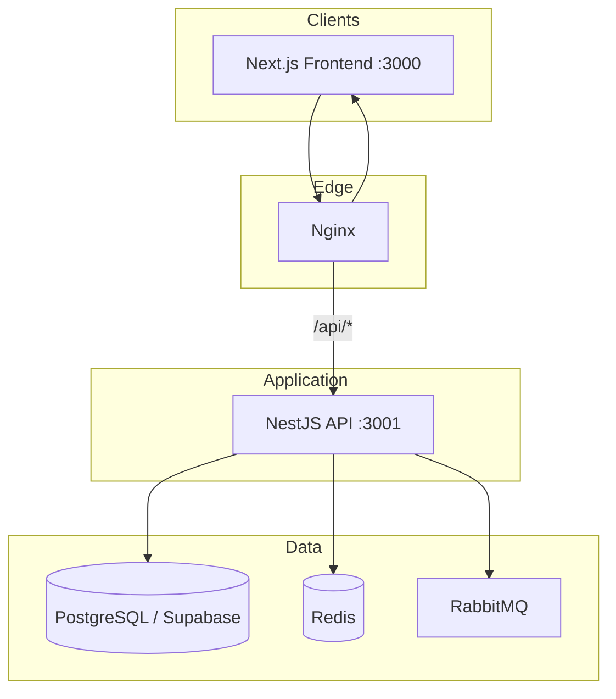

# Merchant Management System — Tech Stack

## Target stack (implemented scaffold)

| Layer | Technology | Status |
|-------|------------|--------|
| **Frontend** | Next.js, TypeScript, Tailwind, Shadcn UI, TanStack Query | ✅ `Frontend/` |
| **Backend** | NestJS, TypeScript, Prisma, PostgreSQL | ✅ `Backend/` |
| **Cache** | Redis | ✅ `RedisModule` + `docker/redis` |
| **Queue** | RabbitMQ | ✅ `QueueModule` + `docker/rabbitmq` |
| **Database** | PostgreSQL (Supabase) | ✅ SQL in `Database/` + Prisma core models |
| **Deploy** | Docker, Nginx | ✅ `docker/` Dockerfiles + `nginx.conf` |
| **Cloud** | AWS | 📋 Phase 7 (ECR/ECS/RDS — documented below) |
| **Auth** | JWT + refresh | 📋 Phase 2 |
| **Storage** | AWS S3 | 📋 Phase 5 |
| **Reporting** | Metabase / custom | 📋 Phase 6 |

## Architecture



## Repository layout

```
Merchant Management System/
├── Frontend/          → Next.js (App Router, TypeScript)
├── Backend/           → NestJS + Prisma
├── Database/          → SQL migrations, seeds
├── docker/            → compose, Nginx, prod stack
├── Architecture/      → This doc, module breakdown
└── Docs/              → BRD, OpenAPI
```

## Local development

```bash
# Infrastructure (Redis + RabbitMQ)
cd docker && docker compose up -d

# Backend (port 3001)
cd Backend && cp .env.example .env   # fill DATABASE_URL
npm install && npm run start:dev

# Frontend (port 3000)
cd Frontend && cp .env.example .env  # NEXT_PUBLIC_* keys
npm install && npm run dev
```

## Prisma & database

1. Apply SQL: `Database/migrations/001_initial_schema.sql`, `002_seed_reference.sql`
2. Generate client: `cd Backend && npx prisma generate`
3. Full schema sync: `npm run db:pull` (introspect all tables from Postgres)

Core models in `Backend/prisma/schema.prisma` cover acquirers, users, merchants, payments. Expand via `db:pull` or additional models.

## NestJS modules (current)

| Module | Purpose |
|--------|---------|
| `ConfigModule` | Env validation (Joi) |
| `PrismaModule` | PostgreSQL via Prisma |
| `HealthModule` | `GET /api/v1/health` |
| `RedisModule` | ioredis client |
| `QueueModule` | RabbitMQ (`@golevelup/nestjs-rabbitmq`) |
| `SupabaseModule` | Service-role client (optional) |

## Phase plan (remaining)

### Phase 2 — Authentication
- NestJS JWT + refresh, guards
- Next.js login, secure token storage

### Phase 5 — AWS S3
- `@aws-sdk/client-s3`, presigned uploads

### Phase 6 — Reporting
- Metabase or custom dashboards

### Phase 7 — AWS production
- ECR, ECS/Fargate, RDS, ElastiCache, Amazon MQ
- Use `docker/docker-compose.prod.yml` as starting point

## Notes

- **Next.js** = UI only; **NestJS** owns all business logic.
- **Supabase** = hosted Postgres for dev; migrate to RDS on AWS when ready.
- Set `REDIS_ENABLED=false` / `RABBITMQ_ENABLED=false` if Docker services are not running.
