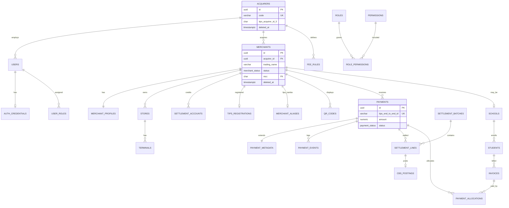
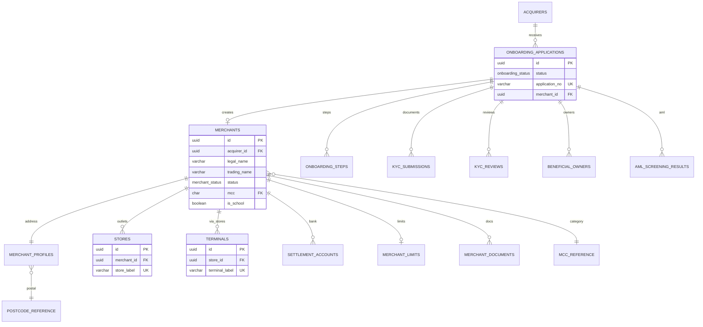
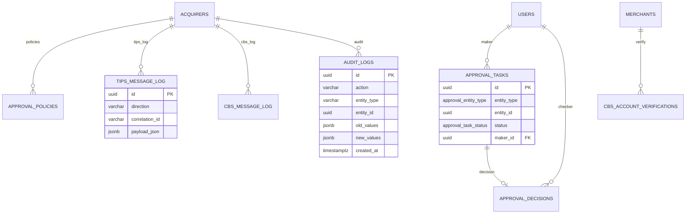

# MMS PostgreSQL Database Schema
# Version 1.0

| Artifact | Path |
|----------|------|
| DDL migration | `Database/migrations/001_initial_schema.sql` |
| Reference seeds | `Database/migrations/002_seed_reference.sql` |
| Derived from | BRD, Module Breakdown, Enterprise Architecture |

---

## Design conventions

### Audit fields (mutable business tables)

| Column | Type | Description |
|--------|------|-------------|
| `created_at` | `TIMESTAMPTZ` | Row creation (default `now()`) |
| `updated_at` | `TIMESTAMPTZ` | Last update (trigger-maintained) |
| `created_by` | `UUID` | FK → `users.id` (nullable for system) |
| `updated_by` | `UUID` | FK → `users.id` |

### Soft delete (mutable business tables)

| Column | Type | Description |
|--------|------|-------------|
| `deleted_at` | `TIMESTAMPTZ` | NULL = active; set on soft delete |
| `deleted_by` | `UUID` | User who performed delete |

**Query rule:** `WHERE deleted_at IS NULL` on all application reads unless archival.

**Tables WITHOUT soft delete (append-only / immutable):**
`audit_logs`, `payment_events`, `tips_message_log`, `cbs_message_log`, `login_attempts`, `alias_generation_log`, `qr_payload_versions`, `recon_matches`, `approval_decisions`, `health_check_history`

### Primary keys

- **UUID** (`gen_random_uuid()`) — business entities
- **Natural keys** — reference tables (`mcc_reference`, `postcode_reference`)

### Money

- `NUMERIC(18,2)` for TZS amounts
- Currency column `CHAR(3)` default `'TZS'`

---

## Table inventory (70 tables)

| Domain | Count | Tables |
|--------|-------|--------|
| Core / Config | 10 | acquirers, system_config, feature_flags, business_calendar, fee_rules, mcc_reference, postcode_reference, qr_templates, acquirer_code_blocks, onboarding_rejection_reasons |
| Identity | 14 | users, user_profiles, user_invitations, auth_credentials, refresh_tokens, login_attempts, password_reset_tokens, api_clients, permissions, roles, role_permissions, user_roles |
| Merchant | 11 | merchants, merchant_profiles, stores, terminals, settlement_accounts, merchant_limits, merchant_risk_scores, merchant_documents, onboarding_*, kyc_*, beneficial_owners, aml_screening_results |
| TIPS / QR | 7 | tips_registrations, merchant_aliases, alias_generation_log, qr_codes, qr_payload_versions, qr_render_assets |
| Payments | 6 | payments, payment_metadata, payment_events, idempotency_keys, refunds |
| Settlement | 3 | settlement_batches, settlement_lines, cbs_postings |
| Reconciliation | 5 | recon_runs, recon_sources, recon_matches, recon_exceptions, recon_resolutions |
| School | 10 | schools, academic_years, school_classes, terms, fee_items, students, invoices, invoice_lines, payment_allocations, student_balances |
| Approvals | 3 | approval_policies, approval_tasks, approval_decisions |
| Notifications | 4 | notification_templates, notification_log, notification_preferences, in_app_notifications |
| Reporting | 4 | report_definitions, report_jobs, report_schedules, dashboard_snapshots |
| Integration | 5 | tips_message_log, tips_settlement_files, cbs_message_log, cbs_account_verifications, cbs_statements |
| Audit / Ops | 3 | audit_logs, health_check_history, sla_metrics_daily |

---

## Entity Relationship Diagram — Overview



---

## ERD — Identity & Authorization

```mermaid
erDiagram
  ACQUIRERS ||--o{ USERS : has
  USERS ||--|| USER_PROFILES : profile
  USERS ||--|| AUTH_CREDENTIALS : auth
  USERS ||--o{ REFRESH_TOKENS : sessions
  USERS ||--o{ USER_ROLES : roles
  ROLES ||--o{ ROLE_PERMISSIONS : perms
  PERMISSIONS ||--o{ ROLE_PERMISSIONS : on
  ACQUIRERS ||--o{ API_CLIENTS : integrators
  USERS ||--o{ USER_INVITATIONS : invites

  USERS {
    uuid id PK
    uuid acquirer_id FK
    uuid merchant_id FK
    citext email UK
    user_status status
    timestamptz created_at
    timestamptz deleted_at
  }

  AUTH_CREDENTIALS {
    uuid user_id PK_FK
    varchar password_hash
    boolean mfa_enabled
    timestamptz lockout_until
  }

  REFRESH_TOKENS {
    uuid id PK
    uuid user_id FK
    varchar token_hash
    uuid family_id
    timestamptz expires_at
    timestamptz revoked_at
  }

  ROLES {
    uuid id PK
    varchar code UK
    boolean is_system
  }

  PERMISSIONS {
    uuid id PK
    varchar code UK
    varchar module
  }
```

---

## ERD — Merchant & Onboarding



---

## ERD — TIPS, QR & Lipa Namba

```mermaid
erDiagram
  MERCHANTS ||--o| TIPS_REGISTRATIONS : tips_id26
  MERCHANTS ||--o| MERCHANT_ALIASES : alias_8
  MERCHANTS ||--o{ QR_CODES : qr
  QR_CODES ||--o{ QR_PAYLOAD_VERSIONS : versions
  QR_CODES ||--o{ QR_RENDER_ASSETS : assets
  QR_CODES }o--o| STORES : optional
  QR_CODES }o--o| TERMINALS : optional
  ACQUIRERS ||--o{ QR_TEMPLATES : branding

  TIPS_REGISTRATIONS {
    uuid id PK
    uuid merchant_id FK_UK
    char acquirer_id_5
    varchar merchant_id_15 UK
    varchar domain_name
    tips_registration_status status
  }

  MERCHANT_ALIASES {
    uuid id PK
    uuid merchant_id FK_UK
    char alias_8digit UK
    char acquirer_code_3
    char merchant_code_4
    char checksum_1
  }

  QR_CODES {
    uuid id PK
    uuid merchant_id FK
    qr_type qr_type
    qr_status status
    char poi_method
    timestamptz expires_at
  }

  QR_PAYLOAD_VERSIONS {
    uuid id PK
    uuid qr_id FK
    int version
    text tlv_payload
    char crc_value
    numeric amount
  }
```

---

## ERD — Payments, Settlement & Reconciliation

```mermaid
erDiagram
  MERCHANTS ||--o{ PAYMENTS : txn
  PAYMENTS ||--|| PAYMENT_METADATA : meta
  PAYMENTS ||--o{ PAYMENT_EVENTS : events
  PAYMENTS ||--o{ REFUNDS : refunds
  PAYMENTS ||--o| SETTLEMENT_LINES : one_line
  SETTLEMENT_BATCHES ||--o{ SETTLEMENT_LINES : batch
  SETTLEMENT_LINES ||--o| CBS_POSTINGS : cbs

  ACQUIRERS ||--o{ RECON_RUNS : daily
  RECON_RUNS ||--o{ RECON_SOURCES : sources
  RECON_RUNS ||--o{ RECON_MATCHES : matches
  RECON_RUNS ||--o{ RECON_EXCEPTIONS : breaks
  RECON_EXCEPTIONS ||--o{ RECON_RESOLUTIONS : resolved

  PAYMENTS {
    uuid id PK
    varchar tips_end_to_end_id UK
    numeric amount
    payment_status status
    payment_channel channel
    timestamptz received_at
  }

  SETTLEMENT_BATCHES {
    uuid id PK
    varchar batch_no UK
    settlement_batch_status status
    numeric net_total
  }

  SETTLEMENT_LINES {
    uuid id PK
    uuid payment_id FK_UK
    numeric net_amount
  }

  CBS_POSTINGS {
    uuid id PK
    varchar idempotency_key UK
    cbs_posting_status status
  }

  RECON_EXCEPTIONS {
    uuid id PK
    recon_exception_status status
    varchar exception_type
  }
```

---

## ERD — School Fee Collection

```mermaid
erDiagram
  MERCHANTS ||--|| SCHOOLS : is_school
  MERCHANTS ||--o{ ACADEMIC_YEARS : years
  ACADEMIC_YEARS ||--o{ TERMS : terms
  MERCHANTS ||--o{ FEE_ITEMS : fees
  MERCHANTS ||--o{ SCHOOL_CLASSES : classes
  MERCHANTS ||--o{ STUDENTS : students
  STUDENTS }o--o| SCHOOL_CLASSES : class
  STUDENTS ||--o{ INVOICES : invoices
  TERMS ||--o{ INVOICES : term
  INVOICES ||--o{ INVOICE_LINES : lines
  FEE_ITEMS ||--o{ INVOICE_LINES : item
  INVOICES ||--o{ PAYMENT_ALLOCATIONS : paid
  PAYMENTS ||--o{ PAYMENT_ALLOCATIONS : pays
  INVOICES }o--o| QR_CODES : dynamic_qr
  STUDENTS ||--o| STUDENT_BALANCES : balance

  SCHOOLS {
    uuid merchant_id PK_FK
    varchar registration_no
  }

  STUDENTS {
    uuid id PK
    varchar admission_no UK
    bytea guardian_phone_enc
  }

  INVOICES {
    uuid id PK
    varchar bill_number UK
    invoice_status status
    numeric total_amount
    numeric paid_amount
    uuid qr_id FK
  }

  PAYMENT_ALLOCATIONS {
    uuid id PK
    uuid payment_id FK
    uuid invoice_id FK
    numeric amount
  }
```

---

## ERD — Approvals, Audit & Integration



---

## Key constraints summary

| Constraint | Tables | Rule |
|------------|--------|------|
| **UNIQUE** | `payments.tips_end_to_end_id` | TIPS idempotency |
| **UNIQUE** | `merchant_aliases.alias_8digit` | Lipa Namba uniqueness |
| **UNIQUE** | `settlement_lines.payment_id` | One settlement line per payment |
| **UNIQUE** | `invoices.bill_number` | School fee bill reference |
| **UNIQUE** | `users (acquirer_id, email)` | Login uniqueness |
| **CHECK** | `qr_codes.poi_method` | `11` or `12` only |
| **CHECK** | `payments.amount > 0` | Positive amounts |
| **FK CASCADE** | `auth_credentials`, `user_roles` | User cleanup |
| **FK RESTRICT** | `payments.merchant_id` | No orphan payments |

---

## Index strategy summary

| Pattern | Example | Purpose |
|---------|---------|---------|
| Partial active rows | `WHERE deleted_at IS NULL` | Soft-delete queries |
| Partial active alias | `WHERE is_active = true` | Lipa Namba lookup |
| Composite time-series | `(merchant_id, received_at DESC)` | Merchant txn history |
| Unique business keys | `tips_end_to_end_id`, `bill_number` | Idempotency |
| Correlation search | `audit_logs`, `tips_message_log` | Investigation |

### Production recommendations (not in v1 DDL)

```sql
-- Partition payments monthly when volume exceeds ~10M rows
-- CREATE TABLE payments (...) PARTITION BY RANGE (received_at);

-- Read replica for Metabase / report_jobs
-- Connection role: mms_readonly
```

---

## Applying migrations

```bash
# Against Supabase or local Postgres
psql "$DATABASE_URL" -f Database/migrations/001_initial_schema.sql
psql "$DATABASE_URL" -f Database/migrations/002_seed_reference.sql
```

---

## Related documents

- `Docs/BRD-Merchant-Management-System.md`
- `Architecture/Enterprise-System-Architecture.md`
- `Architecture/Module-Breakdown.md`

---

**End of Database Schema Documentation**
