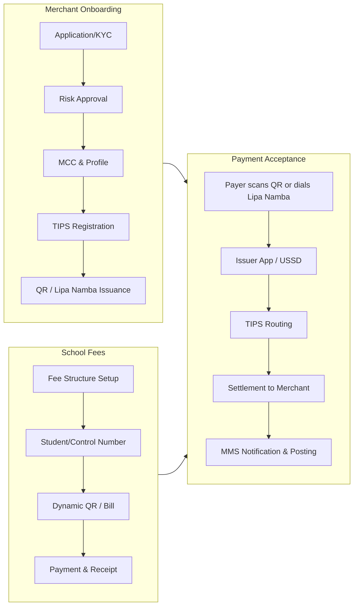

# Business Requirements Document (BRD)
# Merchant Management System (MMS)
# Tanzania National QR / TIPS-Aligned Platform

| Field | Value |
|-------|-------|
| **Document Version** | 1.0 |
| **Date** | 4 June 2026 |
| **Status** | Draft for stakeholder review |
| **Classification** | Internal / Confidential |
| **Prepared by** | Solution Architecture (Fintech / Payments) |

---

## Document control & sources

### Primary regulatory & technical sources (analyzed)

| # | Source | Authority | Version / Date |
|---|--------|-----------|----------------|
| 1 | Tanzania Quick Response Code Standard (**TANQR**) | Bank of Tanzania (BoT) | Standard 2022 (published 12 Aug 2022) |
| 2 | **TIPS** Specific Customization of TANQR (Annex 3) | BoT / TIPS | As per TANQR Standard 2022 |
| 3 | Customer Experience Guideline for **Merchant Payments** | BoT | 2023–2024 circular |
| 4 | EMV® QRCPS Merchant-Presented Mode | EMVCo | v1.0 July 2017 (referenced by TANQR) |
| 5 | National Payment System Act, 2015; BoT Act 2006 | Tanzania | Legal mandate for BoT oversight |
| 6 | Electronic Money Regulations, 2015 | Tanzania | EMI participation in TANQR |

### Project-specific requirements

> **Gap notice:** No separate “project requirements” attachment was found in the repository at analysis time. Sections marked **[PRJ]** denote capabilities typically specified in acquirer/PSP MMS RFPs and should be validated against your internal requirements document when attached.

### Revision history

| Version | Date | Author | Changes |
|---------|------|--------|---------|
| 1.0 | 04-Jun-2026 | Architecture | Initial BRD from TANQR, TIPS, BoT guidelines |

---

## Table of contents

1. [Executive summary](#1-executive-summary)
2. [Business requirements analysis](#2-business-requirements-analysis)
3. [Functional requirements](#3-functional-requirements)
4. [Non-functional requirements](#4-non-functional-requirements)
5. [Compliance requirements](#5-compliance-requirements)
6. [User roles](#6-user-roles)
7. [Actors](#7-actors)
8. [System modules](#8-system-modules)
9. [Integration requirements](#9-integration-requirements)
10. [School fees collection requirements](#10-school-fees-collection-requirements)
11. [Reporting requirements](#11-reporting-requirements)
12. [Security requirements](#12-security-requirements)
13. [Complete feature inventory](#13-complete-feature-inventory)
14. [Assumptions, constraints & dependencies](#14-assumptions-constraints--dependencies)
15. [Appendices](#15-appendices)

---

## 1. Executive summary

The **Merchant Management System (MMS)** is an acquirer-facing platform to **enroll, manage, settle, and monitor merchants** accepting digital payments through **TANQR-compliant QR codes** and **TIPS** (Tanzania Instant Payment System), including **Lipa Namba** (Pay by Phone) aliases for feature-phone users.

The platform must support **interoperable retail and institutional payments** (P2B/P2M), with a dedicated vertical for **school fees collection** aligned to bill-payment and control-number practices used in Tanzania’s payment ecosystem (including future **GePG / TIPS** integration patterns).

**Strategic objectives (from BoT / market context):**

- Deepen **financial inclusion** via standardized e-payments.
- Enable **interoperability** across banks, EMIs, and PSPs.
- Allow BoT to **regulate and oversee** QR-based merchant payments.
- Reduce fragmentation by migrating legacy QR / Lipa Namba to **TANQR 2022**.
- Support **real-time** clearing/settlement via TIPS.

---

## 2. Business requirements analysis

### 2.1 Business context

| Dimension | Description |
|-----------|-------------|
| **Industry** | Retail payments, merchant acquiring, national payment switch (TIPS) |
| **Jurisdiction** | United Republic of Tanzania |
| **Currency** | Tanzanian Shilling (TZS, ISO 4217 numeric **834**) |
| **Regulator** | Bank of Tanzania (National Payment System oversight) |
| **Participants** | Acquirers (banks/EMIs), issuers, merchants, payers, TIPS, network facilitators |

### 2.2 Problem statement

| ID | Problem | Business impact |
|----|---------|-----------------|
| BR-P01 | Fragmented merchant QR codes per PSP | Poor interoperability; payer confusion |
| BR-P02 | Manual merchant onboarding & KYC | Slow time-to-market; compliance risk |
| BR-P03 | Limited visibility on merchant transactions & settlement | Reconciliation errors; disputes |
| BR-P04 | Non-standard feature-phone merchant IDs | Failed USSD / Lipa Namba journeys |
| BR-P05 | School fee collection via cash / siloed channels | Leakage, poor audit trail, parent friction |
| BR-P06 | Inability to generate **dynamic** QR per invoice/term | Wrong amount entry; fraud/error risk |

### 2.3 Business goals

| ID | Goal | Success metric (indicative) |
|----|------|-----------------------------|
| BR-G01 | 100% new merchants issued **TANQR-compliant** static/dynamic QR | % merchants with valid CRC payload |
| BR-G02 | TIPS **Merchant ID (ID 26)** correctly assigned per acquirer rules | Zero invalid ID 26 payloads |
| BR-G03 | **Lipa Namba** alias (8-digit, Damm checksum) for feature phones | % merchants with valid alias |
| BR-G04 | Reduce merchant onboarding SLA | e.g. &lt; 48h for standard KYC |
| BR-G05 | Real-time payment notification to merchants | &lt; 5s notification latency (NFR) |
| BR-G06 | School fee collection digitization | % fees via digital vs cash baseline |
| BR-G07 | Regulatory reporting to BoT / internal compliance | 100% scheduled reports delivered |

### 2.4 Business processes (high level)



### 2.5 Stakeholder requirements

| Stakeholder | Need |
|-------------|------|
| **Acquirer (bank/EMI)** | Merchant lifecycle, limits, settlement, reporting, TIPS participant codes |
| **Merchant** | Accept payments, view balance/transactions, print QR, optional POS/API |
| **Payer (customer)** | Consistent journey per BoT Customer Experience Guideline |
| **BoT** | Standard adherence, auditability, risk oversight |
| **TIPS operator** | Valid routing, directory, acquirer ID, message format alignment |
| **School / education merchant** | Student billing, control numbers, term fees, receipts |
| **Operations** | Disputes, chargebacks, reconciliation, support |
| **Finance** | Settlement files, GL mapping, fee/charge management |

### 2.6 Business rules (core)

| ID | Rule |
|----|------|
| BR-R01 | All QR payloads for TIPS must use Merchant Account Information **ID 26** with GUID **`tz.go.bot.tips`**. |
| BR-R02 | **Acquirer ID** (5 numeric) = 2-digit category + 3-digit participant code (assigned at TIPS registration). |
| BR-R03 | **Merchant ID** (ID 26 sub-02): max **15 numeric** digits, assigned by acquirer. |
| BR-R04 | **Alias Merchant ID** for feature phones: **8 digits** = AAA (acquirer) + CCCC (merchant) + S (Damm checksum); display format **00112349** style. |
| BR-R05 | **Static QR**: Point of Initiation = **11**; amount entered by payer unless optional field populated. |
| BR-R06 | **Dynamic QR**: Point of Initiation = **12**; amount mandatory in payload (ID 54). |
| BR-R07 | Transaction currency must be **834** (TZS) for domestic TANQR. |
| BR-R08 | Country code must be **TZ** (ISO 3166-1 alpha-2). |
| BR-R09 | CRC (ID 63) mandatory; ISO/IEC 13239 polynomial 1021, init FFFF. |
| BR-R10 | Payload Format Indicator (ID 00) = **01**. |
| BR-R11 | MCC (ID 52) per ISO 18245; default **0000** if unavailable. |
| BR-R12 | Postal code (ID 61): **5 numeric** per TCRA Tanzania postcodes. |
| BR-R13 | Merchant name (ID 59) max **25** chars; city (ID 60) max **15** chars. |
| BR-R14 | Additional Data Template (ID 62) max **99** chars total—prefer sub-IDs 01–49. |
| BR-R15 | QR display layout must follow **Annex 2** (logos, QR image min A8, merchant details, FSP branding). |
| BR-R16 | TIPS logo placement **left** when multiple network facilitators shown. |
| BR-R17 | Legacy non-TANQR QR must be **migrated** to TANQR (BoT circular expectation). |
| BR-R18 | School fee payments must carry **bill number / reference** in ID 62 where applicable. |

---

## 3. Functional requirements

### 3.1 Merchant lifecycle management

| ID | Requirement | Priority | Source |
|----|-------------|----------|--------|
| FR-M01 | Register merchant legal entity and trading name (maps to ID 59) | Must | TANQR / [PRJ] |
| FR-M02 | Capture merchant city, postal code, country (TZ), address | Must | TANQR |
| FR-M03 | Assign and maintain **MCC** (ISO 18245) | Must | TANQR |
| FR-M04 | Support merchant categories: retail, restaurant, school, utility, NGO, etc. | Must | [PRJ] |
| FR-M05 | KYC document upload, verification workflow, approval/rejection | Must | [PRJ] / AML |
| FR-M06 | Merchant status: draft, pending, active, suspended, closed | Must | [PRJ] |
| FR-M07 | Multi-outlet / store hierarchy (Store Label ID 62 sub-03) | Should | TANQR |
| FR-M08 | Multi-terminal per store (Terminal Label ID 62 sub-07) | Should | TANQR |
| FR-M09 | Merchant contact, settlement account(s), tax ID (ID 62 extensible) | Must | [PRJ] |
| FR-M10 | Merchant risk scoring and transaction limits | Must | [PRJ] |
| FR-M11 | Merchant profile versioning and audit trail | Must | [PRJ] |
| FR-M12 | Bulk merchant import (file/API) | Should | [PRJ] |
| FR-M13 | Merchant self-service portal (profile, QR download) | Should | [PRJ] |

### 3.2 Acquirer & TIPS identity management

| ID | Requirement | Priority | Source |
|----|-------------|----------|--------|
| FR-T01 | Maintain acquirer **participant code** and derived **Acquirer ID** (5-digit) | Must | TIPS Ann.3 |
| FR-T02 | Auto-generate **Merchant ID** (≤15 numeric) unique per acquirer | Must | TIPS Ann.3 |
| FR-T03 | Register merchant with TIPS directory (when API available) | Must | TIPS |
| FR-T04 | Map merchant to TIPS **alias** (8-digit Lipa Namba) with **Damm** checksum | Must | TIPS Ann.3 |
| FR-T05 | Support additional acquirer code blocks per TIPS rules | Should | TIPS Ann.3 |
| FR-T06 | Extend merchant code digit when acquirer block exhausted | Could | TIPS Ann.3 |
| FR-T07 | Store Domain Name `tz.go.bot.tips` in all TIPS QR templates | Must | TIPS Ann.3 |

### 3.3 QR code management (TANQR)

| ID | Requirement | Priority | Source |
|----|-------------|----------|--------|
| FR-Q01 | Generate **static** TANQR payload (POI method 11) | Must | TANQR |
| FR-Q02 | Generate **dynamic** TANQR per transaction (POI method 12) | Must | TANQR |
| FR-Q03 | Compute **CRC16** checksum per ISO/IEC 13239 | Must | TANQR |
| FR-Q04 | Render QR image (PNG/SVG/PDF) per **Annex 2 layout** | Must | TANQR |
| FR-Q05 | Part A: Network facilitator logos (TIPS left) | Must | TANQR Ann.2 |
| FR-Q06 | Part B: QR image sizing per paper standard (min A8, 11% area) | Must | TANQR Ann.2 |
| FR-Q07 | Part C: Merchant name + Lipa Namba / Merchant ID for USSD | Must | TANQR Ann.2 |
| FR-Q08 | Part D: FSP acquirer branding | Must | TANQR Ann.2 |
| FR-Q09 | Optional: transaction amount, tip/convenience (ID 55–57) | Should | TANQR |
| FR-Q10 | Optional: bill number, reference, purpose (ID 62 sub 01,05,08) | Must | TANQR / School |
| FR-Q11 | Optional: mobile number, consumer label (ID 62 sub 02,06) | Should | TANQR |
| FR-Q12 | Optional: language template (ID 64) for Swahili display | Should | TANQR |
| FR-Q13 | Optional: date/time template (ID 80) generation & expiry | Should | TANQR |
| FR-Q14 | QR regeneration on merchant detail change | Must | [PRJ] |
| FR-Q15 | QR revocation / invalidation | Must | [PRJ] |
| FR-Q16 | Validate payload before issuance (schema + CRC) | Must | TANQR |
| FR-Q17 | Migration tool: legacy QR → TANQR payload mapping | Must | BoT circular |
| FR-Q18 | API to request dynamic QR for amount + reference | Must | [PRJ] |
| FR-Q19 | Print batch QR stickers / stands | Should | [PRJ] |

### 3.4 Payment processing & notifications

| ID | Requirement | Priority | Source |
|----|-------------|----------|--------|
| FR-P01 | Receive payment callbacks/webhooks from TIPS / switch | Must | TIPS |
| FR-P02 | Match payment to merchant, store, terminal | Must | [PRJ] |
| FR-P03 | Idempotent payment posting | Must | [PRJ] |
| FR-P04 | Real-time merchant notification (SMS, email, push, in-app) | Must | [PRJ] |
| FR-P05 | Payment states: initiated, success, failed, reversed, disputed | Must | TIPS |
| FR-P06 | Support **Request to Pay** (when TIPS product enabled) | Could | TIPS roadmap |
| FR-P07 | Support **transfer reversal** handling | Must | TIPS |
| FR-P08 | Payer verification display fields (name, amount, merchant) | Must | CX Guideline |
| FR-P09 | Transaction reference alignment to TIPS message format | Must | CX Guideline |
| FR-P10 | Partial payments (where product allows) | Should | School fees |

### 3.5 Settlement & reconciliation

| ID | Requirement | Priority | Source |
|----|-------------|----------|--------|
| FR-S01 | Settlement calendar (T+0/T+1 per acquirer policy) | Must | [PRJ] |
| FR-S02 | Settlement batch generation per merchant | Must | [PRJ] |
| FR-S03 | Fee/charge deduction (interchange, MDR, TIPS charges) | Must | BoT circulars |
| FR-S04 | Settlement account crediting instructions export | Must | [PRJ] |
| FR-S05 | Daily reconciliation: TIPS vs MMS vs core banking | Must | [PRJ] |
| FR-S06 | Exception queue for unmatched items | Must | [PRJ] |
| FR-S07 | Merchant statement generation (PDF/CSV) | Must | [PRJ] |

### 3.6 Disputes, refunds & chargebacks

| ID | Requirement | Priority | Source |
|----|-------------|----------|--------|
| FR-D01 | Initiate refund (full/partial) via TIPS | Must | [PRJ] |
| FR-D02 | Dispute case management workflow | Should | [PRJ] |
| FR-D03 | Link dispute to original transaction & QR reference | Must | [PRJ] |
| FR-D04 | Fraud flag integration (TIPS Fraud Utility when available) | Should | TIPS |

### 3.7 Administration & configuration

| ID | Requirement | Priority | Source |
|----|-------------|----------|--------|
| FR-A01 | Acquirer-level configuration (branding, fees, limits) | Must | [PRJ] |
| FR-A02 | User management (roles, MFA, password policy) | Must | Security |
| FR-A03 | System parameter management (TZS, timeouts, QR templates) | Must | [PRJ] |
| FR-A04 | Holiday / cut-off configuration | Should | [PRJ] |
| FR-A05 | Multi-language UI (English, Swahili) | Should | TANQR ID 64 |
| FR-A06 | Audit log for all admin actions | Must | Compliance |

### 3.8 API & channel support

| ID | Requirement | Priority | Source |
|----|-------------|----------|--------|
| FR-API01 | REST API for merchant CRUD | Must | [PRJ] |
| FR-API02 | REST API for dynamic QR generation | Must | [PRJ] |
| FR-API03 | REST API for transaction query | Must | [PRJ] |
| FR-API04 | Webhook subscription for payment events | Must | [PRJ] |
| FR-API05 | API authentication (OAuth2/client credentials + JWT) | Must | Security |
| FR-API06 | Rate limiting and API keys per integrator | Must | Security |
| FR-API07 | POS / e-commerce plugin SDK documentation | Could | [PRJ] |

---

## 4. Non-functional requirements

### 4.1 Performance

| ID | Requirement | Target |
|----|-------------|--------|
| NFR-P01 | API response time (95th percentile) | ≤ 500 ms (excl. QR image render) |
| NFR-P02 | Dynamic QR generation | ≤ 2 s end-to-end |
| NFR-P03 | Payment webhook processing | ≤ 3 s to merchant notification |
| NFR-P04 | Concurrent merchants supported | [PRJ] scale tier (e.g. 100k+) |
| NFR-P05 | Peak TPS for payment ingestion | Per TIPS/acquirer capacity planning |

### 4.2 Availability & reliability

| ID | Requirement | Target |
|----|-------------|--------|
| NFR-A01 | Platform availability | 99.9% monthly (excl. planned maintenance) |
| NFR-A02 | RPO (data loss) | ≤ 15 minutes |
| NFR-A03 | RTO (recovery) | ≤ 4 hours |
| NFR-A04 | Zero data loss for posted financial transactions | Mandatory |

### 4.3 Scalability

| ID | Requirement |
|----|-------------|
| NFR-S01 | Horizontal scaling of API and workers |
| NFR-S02 | Queue-based async processing (RabbitMQ) for notifications, settlement |
| NFR-S03 | Redis caching for merchant profile and QR templates |
| NFR-S04 | Read replicas for reporting queries |

### 4.4 Maintainability

| ID | Requirement |
|----|-------------|
| NFR-M01 | Modular NestJS architecture aligned to target stack |
| NFR-M02 | OpenAPI specification for all public APIs |
| NFR-M03 | Config-driven QR field mapping (no hard-coded payload logic in UI) |
| NFR-M04 | Feature flags for TIPS product rollout |

### 4.5 Usability

| ID | Requirement |
|----|-------------|
| NFR-U01 | Merchant onboarding ≤ 20 screens for standard case |
| NFR-U02 | QR download in one click (PDF/PNG) |
| NFR-U03 | Accessible UI (WCAG 2.1 AA target) |
| NFR-U04 | Mobile-responsive admin and merchant portals |

### 4.6 Compatibility

| ID | Requirement |
|----|-------------|
| NFR-C01 | EMV QRCPS Merchant-Presented Mode compatibility |
| NFR-C02 | All major issuer apps scanning TANQR |
| NFR-C03 | USSD / feature-phone Lipa Namba entry |
| NFR-C04 | Browsers: latest Chrome, Edge, Firefox, Safari |

### 4.7 Data retention

| ID | Requirement | Target |
|----|-------------|--------|
| NFR-D01 | Transaction data retention | ≥ 7 years (financial/audit) |
| NFR-D02 | Audit logs | ≥ 7 years |
| NFR-D03 | KYC documents | Per AML regulation |

---

## 5. Compliance requirements

### 5.1 Regulatory (Tanzania / BoT)

| ID | Requirement | Reference |
|----|-------------|-----------|
| CR-01 | Comply with **TANQR Code Standard 2022** for all issued QR | BoT circular Aug 2022 |
| CR-02 | Comply with **TIPS** Merchant Account Information ID 26–30 | TANQR Ann.3 |
| CR-03 | Comply with **Customer Experience Guideline for Merchant Payments** | BoT 2023/2024 |
| CR-04 | Operate under **National Payment System Act, 2015** | Legal |
| CR-05 | EMI participants comply with **Electronic Money Regulations, 2015** | Legal |
| CR-06 | Align message formats to **TIPS Guide** documents | CX Guideline |
| CR-07 | Adhere to **TIPS/TISS/TACH** fee and charging circulars | BoT |
| CR-08 | **AML/CFT** customer due diligence for merchants | AML Regulations 2022 |
| CR-09 | **KYC** for beneficial owners and directors | AML |
| CR-10 | **STR/SAR** reporting integration capability | AML |
| CR-11 | **Data protection** consent and purpose limitation | Tanzania DPA context |
| CR-12 | **PCI-DSS** scope minimization (no storage of sensitive auth data) | Industry |
| CR-13 | Publish/display **bank charges** transparency where required | BoT circular |
| CR-14 | **Financial Service Registry** alignment (FSP registration data) | BoT circular |
| CR-15 | Participate in BoT **examination and monitoring** | BoT statements |

### 5.2 Standards mapping

| Standard | Application in MMS |
|----------|-------------------|
| EMV QRCPS v1.0 | QR payload structure |
| ISO 4217 | Currency 834 (TZS) |
| ISO 3166-1 | Country TZ |
| ISO 18245 | MCC |
| ISO/IEC 13239 | CRC16 |
| TCRA postcodes | ID 61 validation |

### 5.3 Operational compliance

| ID | Requirement |
|----|-------------|
| CR-O01 | Immutable audit trail for QR issuance and payment state changes |
| CR-O02 | Segregation of duties (maker-checker) for merchant approval |
| CR-O03 | Regulatory report export (volume, value, merchant counts) |
| CR-O04 | Incident reporting process for security breaches |

---

## 6. User roles

| Role | Description | Typical permissions |
|------|-------------|---------------------|
| **Super Admin** | Platform owner (acquirer IT) | Full system config, all tenants |
| **Acquirer Admin** | Bank/EMI operations head | Acquirer config, users, limits, reports |
| **Compliance Officer** | AML/KYC | Approve/reject merchants, STR review, audit reports |
| **Operations Manager** | Day-to-day ops | Settlements, reconciliation, disputes |
| **Operations Analyst** | Support tier 2 | Transaction search, exception handling |
| **Support Agent** | Helpdesk | Read-only merchant/txn, ticket creation |
| **Finance Officer** | Settlement & GL | Settlement batches, fee config, financial reports |
| **Risk Manager** | Risk & fraud | Limits, blocks, fraud rules |
| **Merchant Admin** | Business owner | Outlets, users, QR download, settlements view |
| **Merchant Cashier** | Store-level | Accept payments, view store txns, print QR |
| **School Bursar** | Education vertical | Fee structures, students, receipts |
| **School Admin** | Institution head | Reports, user management within school |
| **API Integrator** | Technical merchant | API keys, webhooks (scoped) |
| **Auditor (read-only)** | Internal/external audit | Read logs, reports, no write |
| **BoT Examiner (read-only)** | Regulatory access | Compliance dashboards [PRJ] |

---

## 7. Actors

| Actor | Type | Interaction |
|-------|------|-------------|
| **Payer (Customer)** | External human | Scans QR, enters Lipa Namba, confirms payment |
| **Merchant** | External organization | Receives funds, manages profile |
| **Acquirer (Bank/EMI)** | Internal organization | Owns MMS, settles merchants |
| **Issuer (Bank/EMI)** | External system | Customer account debiting |
| **TIPS** | External system | Switching, clearing, directory |
| **Network Facilitator** | External | Routing when issuer ≠ acquirer |
| **TANQR Validator** | Internal component | CRC/schema validation |
| **Core Banking System** | External | Settlement account posting |
| **SMS Gateway** | External | Notifications |
| **Email Service** | External | Notifications |
| **School / Education Institution** | External org | Fee billing entity |
| **Parent / Guardian** | External human | Pays school fees |
| **GePG (Government e-Payment Gateway)** | External (future) | Bill/control number sync [PRJ] |
| **Metabase / BI** | Internal/external | Reporting consumer |
| **AWS S3** | Infrastructure | Document/storage |
| **Redis** | Infrastructure | Cache |
| **RabbitMQ** | Infrastructure | Async messaging |
| **BoT** | Regulatory | Sets standards, examination |

---

## 8. System modules

| Module | Responsibility | Key entities |
|--------|----------------|--------------|
| **M1 – Identity & Access** | Users, roles, JWT, refresh tokens, MFA | User, Role, Permission, Session |
| **M2 – Merchant Management** | Onboarding, KYC, profile, outlets, terminals | Merchant, Store, Terminal, Document |
| **M3 – TIPS Registration** | Acquirer ID, merchant ID, directory sync | TIPSRegistration, Participant |
| **M4 – QR Engine (TANQR)** | Payload build, CRC, render, Annex 2 layout | QRCode, QRTemplate, PayloadVersion |
| **M5 – Lipa Namba / Alias** | 8-digit alias, Damm algorithm | MerchantAlias |
| **M6 – Payment Ingestion** | Webhooks, matching, idempotency | Payment, PaymentEvent |
| **M7 – Settlement** | Batching, fees, core banking export | SettlementBatch, FeeRule |
| **M8 – Reconciliation** | 3-way match, exceptions | ReconRun, Exception |
| **M9 – Disputes & Refunds** | Cases, TIPS reversal | Dispute, Refund |
| **M10 – School Fees** | Academic structure, billing, control numbers | School, Student, FeeStructure, Invoice |
| **M11 – Notifications** | SMS, email, push templates | Notification, Template |
| **M12 – Reporting & Analytics** | Operational & regulatory reports | ReportDefinition, Schedule |
| **M13 – Document Management** | KYC, QR artwork, receipts (S3) | Document, StorageObject |
| **M14 – Configuration** | Parameters, MCC list, postcodes | SystemConfig, MCC, Postcode |
| **M15 – Audit & Compliance** | Immutable logs, maker-checker | AuditLog, ApprovalTask |
| **M16 – Integration Hub** | Adapters for TIPS, core banking, GePG | IntegrationEndpoint, MessageLog |
| **M17 – Admin Portal API** | Back-office operations | — |
| **M18 – Merchant Portal API** | Self-service | — |
| **M19 – Public API Gateway** | External integrators | ApiClient, Webhook |

---

## 9. Integration requirements

### 9.1 TIPS (mandatory)

| ID | Integration | Direction | Protocol / format | Notes |
|----|-------------|-----------|-------------------|-------|
| INT-T01 | Merchant registration / directory | Bi-dir | TIPS API (per TIPS Guide) | Acquirer ID, Merchant ID |
| INT-T02 | Payment notification / status | Inbound | ISO 20022 / TIPS spec [per guide] | Real-time |
| INT-T03 | Payment initiation (Request to Pay) | Outbound | TIPS | Future |
| INT-T04 | Transfer reversal | Bi-dir | TIPS | Mandatory capability |
| INT-T05 | Fraud utility | Bi-dir | TIPS | When enabled |
| INT-T06 | Alias resolution (Lipa Namba) | Bi-dir | TIPS directory | 8-digit |
| INT-T07 | Message format validation | Internal | TIPS Guide alignment | CX Guideline |

### 9.2 Core banking / wallet

| ID | Integration | Purpose |
|----|-------------|---------|
| INT-C01 | Core banking API | Settlement account credit |
| INT-C02 | Wallet ledger (EMI) | e-money merchant balance |
| INT-C03 | Account verification (name enquiry) | Settlement account validation |

### 9.3 Channel & third party

| ID | Integration | Purpose |
|----|-------------|---------|
| INT-E01 | SMS gateway | OTP, payment alerts |
| INT-E02 | Email (SMTP/SES) | Notifications, statements |
| INT-E03 | AWS S3 | KYC docs, QR assets, exports |
| INT-E04 | GePG | Government/school control numbers [PRJ] |
| INT-E05 | School ERP / SIS | Student sync [PRJ] |
| INT-E06 | Metabase (PostgreSQL read replica) | BI dashboards |
| INT-E07 | Identity provider (optional) | SSO for acquirer staff |

### 9.4 Internal technical integrations (target stack)

| ID | Component | Purpose |
|----|-----------|---------|
| INT-I01 | PostgreSQL | System of record |
| INT-I02 | Redis | Session cache, rate limits, hot merchant data |
| INT-I03 | RabbitMQ | Async: notifications, settlement, webhooks, recon |
| INT-I04 | NestJS ↔ Next.js | Admin UI calls REST/GraphQL API |
| INT-I05 | JWT issuer | Auth across portals |

### 9.5 Integration non-functional

| ID | Requirement |
|----|-------------|
| INT-NF01 | All external calls logged with correlation ID |
| INT-NF02 | Retry with exponential backoff for transient failures |
| INT-NF03 | Circuit breaker for TIPS downtime |
| INT-NF04 | Dead-letter queue for failed messages |
| INT-NF05 | Clock synchronization (NTP) for TIPS timestamps |

---

## 10. School fees collection requirements

> Vertical module for **education merchants** (MCC examples: education services). Aligns with bill-payment patterns (ID 62 Bill Number, Reference Label) and institutional reporting.

### 10.1 Business requirements

| ID | Requirement |
|----|-------------|
| SF-B01 | Schools onboarded as merchants with education MCC |
| SF-B02 | Support term-based and annual fee structures |
| SF-B03 | Each student linked to unique **student ID** and optional **control number** |
| SF-B04 | Parents pay via QR (smartphone) or Lipa Namba (feature phone) |
| SF-B05 | Partial payment and instalments where school policy allows |
| SF-B06 | Automatic receipt generation upon successful payment |
| SF-B07 | Reconciliation report for bursar (paid vs outstanding) |

### 10.2 Functional requirements

| ID | Requirement | Priority |
|----|-------------|----------|
| SF-F01 | School profile: name, registration, address (TANQR fields), contact | Must |
| SF-F02 | Academic year, term, class/grade configuration | Must |
| SF-F03 | Fee item catalog (tuition, transport, exam, boarding, etc.) | Must |
| SF-F04 | Student registry: admission no., name, class, guardian contact | Must |
| SF-F05 | Generate **invoice** per student per term with unique **bill number** (ID 62-01) | Must |
| SF-F06 | Generate **dynamic TANQR** with amount = fee due + reference = student/bill | Must |
| SF-F07 | Static QR at school counter with payer-entered amount (fallback) | Should |
| SF-F08 | Map **Purpose of Transaction** (ID 62-08) e.g. "Term 2 Fees 2026" | Should |
| SF-F09 | Bulk invoice generation for student cohort | Must |
| SF-F10 | Payment allocation: one payment → one or many fee items | Must |
| SF-F11 | Overpayment / underpayment handling rules | Must |
| SF-F12 | SMS/email receipt to guardian with txn reference | Must |
| SF-F13 | School dashboard: collections by class, term, payment channel | Must |
| SF-F14 | Export collections for import to school accounting system | Should |
| SF-F15 | Student statement (historical payments) | Must |
| SF-F16 | Discounts, scholarships, waivers | Should |
| SF-F17 | Late payment penalties (configurable) | Could |
| SF-F18 | Integration with **GePG control numbers** (when TIPS-GePG live) | Could |
| SF-F19 | API for school MIS to post fees due | Should |
| SF-F20 | QR printout including student name/masked ID (privacy) | Must |

### 10.3 School fees data model (logical)

| Entity | Key attributes |
|--------|----------------|
| School | merchant_id, tanqr_profile, lipa_namba_alias |
| AcademicYear | start, end, active |
| Term | academic_year_id, name, due_date |
| FeeItem | code, amount, mandatory_flag |
| Student | admission_no, class_id, guardian_phone |
| Invoice | bill_number, student_id, total, status |
| PaymentAllocation | payment_id, invoice_id, amount |

### 10.4 School fees compliance & audit

| ID | Requirement |
|----|-------------|
| SF-C01 | Fee collection reports retained ≥ 7 years |
| SF-C02 | No disclosure of full student PII on public QR (use bill/ref codes) |
| SF-C03 | Guardian consent for SMS/notifications |
| SF-C04 | Refund policy workflow for erroneous payments |

---

## 11. Reporting requirements

### 11.1 Operational reports

| ID | Report | Audience | Frequency |
|----|--------|----------|-----------|
| REP-O01 | Merchant onboarding pipeline | Operations | Daily |
| REP-O02 | Active/suspended merchant register | Operations | Daily |
| REP-O03 | Transaction summary (count/value) by channel | Operations | Daily |
| REP-O04 | QR issuance log (static/dynamic) | Operations | Daily |
| REP-O05 | Failed / reversed transactions | Operations | Real-time alert + daily |
| REP-O06 | Settlement batch status | Finance | Daily |
| REP-O07 | Reconciliation exceptions | Finance | Daily |
| REP-O08 | Dispute & refund register | Operations | Weekly |

### 11.2 Merchant reports

| ID | Report | Audience | Frequency |
|----|--------|----------|-----------|
| REP-M01 | Merchant statement | Merchant | Daily/monthly |
| REP-M02 | Store-level transaction detail | Merchant | On demand |
| REP-M03 | Settlement advice | Merchant | Per cycle |
| REP-M04 | QR scan vs completed payment funnel | Merchant | Weekly |

### 11.3 School fees reports

| ID | Report | Audience | Frequency |
|----|--------|----------|-----------|
| REP-S01 | Collections by term/class | School bursar | Daily |
| REP-S02 | Outstanding fees (ageing) | School bursar | Weekly |
| REP-S03 | Student payment receipt register | School | On demand |
| REP-S04 | Guardian payment channel breakdown (QR vs USSD) | School | Monthly |

### 11.4 Regulatory & compliance reports

| ID | Report | Audience | Frequency |
|----|--------|----------|-----------|
| REP-R01 | Merchant payment volumes (P2B) | Compliance / BoT | Monthly |
| REP-R02 | TANQR adoption (% migrated) | Compliance | Monthly |
| REP-R03 | Large transaction report (AML threshold) | Compliance | Daily |
| REP-R04 | STR supporting transaction evidence | Compliance | Ad hoc |
| REP-R05 | System availability & incident | Compliance | Monthly |

### 11.5 Analytics / Metabase

| ID | Requirement |
|----|-------------|
| REP-A01 | Metabase connected to read-replica PostgreSQL |
| REP-A02 | Row-level security by acquirer |
| REP-A03 | Dashboards: txn trends, merchant growth, school collections |
| REP-A04 | Custom dashboard in Next.js for embedded KPIs |
| REP-A05 | Export CSV/Excel/PDF for all reports |
| REP-A06 | Scheduled email delivery |

---

## 12. Security requirements

### 12.1 Authentication & authorization

| ID | Requirement |
|----|-------------|
| SEC-01 | JWT access tokens (short-lived, e.g. 15 min) |
| SEC-02 | Refresh tokens (rotating, revocable, httpOnly cookie or secure storage) |
| SEC-03 | Role-based access control (RBAC) per Section 6 |
| SEC-04 | MFA for admin and finance roles |
| SEC-05 | Account lockout after failed login attempts |
| SEC-06 | Password policy (length, complexity, rotation for local accounts) |
| SEC-07 | API keys hashed at rest; scoped permissions |

### 12.2 Data protection

| ID | Requirement |
|----|-------------|
| SEC-10 | TLS 1.2+ for all external communications |
| SEC-11 | Encryption at rest for DB (AES-256) and S3 |
| SEC-12 | Field-level encryption for PII (national ID, phone) |
| SEC-13 | Tokenization / no storage of full PAN |
| SEC-14 | Secrets in vault/KMS, not in source code |
| SEC-15 | Data masking in logs |

### 12.3 Application security

| ID | Requirement |
|----|-------------|
| SEC-20 | OWASP Top 10 mitigation (input validation, CSRF, XSS) |
| SEC-21 | SQL injection prevention (parameterized queries/ORM) |
| SEC-22 | Rate limiting per IP/API key |
| SEC-23 | Webhook HMAC signature verification |
| SEC-24 | QR payload tamper detection via CRC validation |
| SEC-25 | Secure file upload (type, size, malware scan) |

### 12.4 Infrastructure & operations

| ID | Requirement |
|----|-------------|
| SEC-30 | Network segmentation (DMZ, private DB) |
| SEC-31 | WAF on public endpoints |
| SEC-32 | DDoS protection (AWS Shield / CloudFront) |
| SEC-33 | Vulnerability scanning in CI/CD |
| SEC-34 | Penetration test annually |
| SEC-35 | SIEM / centralized logging |
| SEC-36 | Backup encryption and restore drills |

### 12.5 Fraud & monitoring

| ID | Requirement |
|----|-------------|
| SEC-40 | Velocity checks on merchant txn |
| SEC-41 | Anomaly detection (sudden volume spikes) |
| SEC-42 | Blocklist for merchants/MSISDN/IP |
| SEC-43 | Integration with TIPS Fraud Utility when available |

---

## 13. Complete feature inventory

### 13.1 Master feature list (no requirement omitted from analysis)

| # | Feature area | Feature | Req IDs |
|---|--------------|---------|---------|
| 1 | Merchant | Legal entity registration | FR-M01, FR-M05 |
| 2 | Merchant | Trading name & TANQR display name | FR-M01, BR-R13 |
| 3 | Merchant | Address, city, postcode, country TZ | FR-M02, BR-R08–R12 |
| 4 | Merchant | MCC assignment | FR-M03, BR-R11 |
| 5 | Merchant | Category templates | FR-M04 |
| 6 | Merchant | KYC workflow | FR-M05, CR-08 |
| 7 | Merchant | Status lifecycle | FR-M06 |
| 8 | Merchant | Multi-store | FR-M07 |
| 9 | Merchant | Multi-terminal | FR-M08 |
| 10 | Merchant | Settlement accounts | FR-M09 |
| 11 | Merchant | Risk limits | FR-M10 |
| 12 | Merchant | Profile audit trail | FR-M11 |
| 13 | Merchant | Bulk import | FR-M12 |
| 14 | Merchant | Self-service portal | FR-M13 |
| 15 | TIPS | Participant / acquirer ID | FR-T01–T02 |
| 16 | TIPS | Directory registration | FR-T03 |
| 17 | TIPS | Lipa Namba 8-digit alias + Damm | FR-T04, BR-R04 |
| 18 | TIPS | Extended acquirer codes | FR-T05–T06 |
| 19 | TIPS | Domain tz.go.bot.tips | FR-T07 |
| 20 | QR | Static QR (POI 11) | FR-Q01, BR-R05 |
| 21 | QR | Dynamic QR (POI 12) | FR-Q02, BR-R06 |
| 22 | QR | CRC16 computation | FR-Q03, BR-R09 |
| 23 | QR | Annex 2 layout rendering | FR-Q04–Q08 |
| 24 | QR | Tip / convenience fees | FR-Q09 |
| 25 | QR | Bill number & reference fields | FR-Q10 |
| 26 | QR | Consumer/mobile optional fields | FR-Q11 |
| 27 | QR | Swahili language template | FR-Q12 |
| 28 | QR | QR expiry datetime template | FR-Q13 |
| 29 | QR | Regeneration & revocation | FR-Q14–Q15 |
| 30 | QR | Payload validation | FR-Q16 |
| 31 | QR | Legacy migration | FR-Q17, BR-G01 |
| 32 | QR | Dynamic QR API | FR-Q18 |
| 33 | QR | Batch print | FR-Q19 |
| 34 | Payments | TIPS webhooks | FR-P01, INT-T02 |
| 35 | Payments | Transaction matching | FR-P02 |
| 36 | Payments | Idempotency | FR-P03 |
| 37 | Payments | Multi-channel notification | FR-P04 |
| 38 | Payments | Status lifecycle | FR-P05 |
| 39 | Payments | Request to Pay | FR-P06 |
| 40 | Payments | Reversal handling | FR-P07, INT-T04 |
| 41 | Payments | Payer verification UX data | FR-P08 |
| 42 | Payments | TIPS message alignment | FR-P09 |
| 43 | Payments | Partial payments | FR-P10 |
| 44 | Settlement | Calendar & batches | FR-S01–S02 |
| 45 | Settlement | Fee deduction | FR-S03 |
| 46 | Settlement | Core banking export | FR-S04 |
| 47 | Settlement | Reconciliation | FR-S05–S06 |
| 48 | Settlement | Merchant statements | FR-S07 |
| 49 | Disputes | Refunds | FR-D01 |
| 50 | Disputes | Case management | FR-D02–D03 |
| 51 | Disputes | Fraud utility | FR-D04 |
| 52 | Admin | Acquirer config | FR-A01 |
| 53 | Admin | User/RBAC/MFA | FR-A02, SEC-01–06 |
| 54 | Admin | System parameters | FR-A03 |
| 55 | Admin | Cut-offs | FR-A04 |
| 56 | Admin | i18n EN/SW | FR-A05 |
| 57 | Admin | Audit logging | FR-A06 |
| 58 | API | Merchant CRUD API | FR-API01 |
| 59 | API | Dynamic QR API | FR-API02 |
| 60 | API | Transaction query API | FR-API03 |
| 61 | API | Webhooks | FR-API04–FR-API06 |
| 62 | API | POS SDK | FR-API07 |
| 63 | School | School merchant profile | SF-F01 |
| 64 | School | Academic structure | SF-F02 |
| 65 | School | Fee catalog | SF-F03 |
| 66 | School | Student registry | SF-F04 |
| 67 | School | Invoicing & bill number | SF-F05–F06 |
| 68 | School | Counter static QR fallback | SF-F07 |
| 69 | School | Purpose field | SF-F08 |
| 70 | School | Bulk invoicing | SF-F09 |
| 71 | School | Payment allocation | SF-F10–F11 |
| 72 | School | Guardian receipts | SF-F12 |
| 73 | School | Dashboards & exports | SF-F13–F14 |
| 74 | School | Student statements | SF-F15 |
| 75 | School | Discounts/waivers | SF-F16 |
| 76 | School | Penalties | SF-F17 |
| 77 | School | GePG integration | SF-F18 |
| 78 | School | MIS API | SF-F19 |
| 79 | School | Privacy-safe QR print | SF-F20 |
| 80 | Reporting | All operational reports | REP-O01–O08 |
| 81 | Reporting | Merchant reports | REP-M01–M04 |
| 82 | Reporting | School reports | REP-S01–S04 |
| 83 | Reporting | Regulatory reports | REP-R01–R05 |
| 84 | Reporting | Metabase/custom BI | REP-A01–A06 |
| 85 | Security | Full SEC-* catalog | Section 12 |
| 86 | Compliance | Full CR-* catalog | Section 5 |
| 87 | Integration | TIPS, core banking, GePG, S3, Redis, MQ | Section 9 |

**Total traced features: 87** (each maps to one or more detailed requirement IDs above).

---

## 14. Assumptions, constraints & dependencies

### 14.1 Assumptions

| ID | Assumption |
|----|------------|
| A-01 | MMS operator is a **licensed acquirer** (bank/EMI/PSP) with TIPS participant status |
| A-02 | TIPS provides APIs/guides for directory, payments, reversals per participant agreement |
| A-03 | Merchants are domiciled in Tanzania for domestic TANQR (TZ, 834) |
| A-04 | Project requirements document will be merged when provided (gap fill) |

### 14.2 Constraints

| ID | Constraint |
|----|------------|
| C-01 | QR payload size limits (ID 62 template 99 chars) |
| C-02 | Merchant name 25 / city 15 character limits |
| C-03 | BoT examination and mandatory standards compliance |
| C-04 | Cannot store card PAN/CVV in MMS |

### 14.3 Dependencies

| Dependency | Impact |
|------------|--------|
| TIPS availability | Payment processing |
| BoT standard updates | QR engine updates |
| Core banking API | Settlement |
| TCRA postcode master | Validation |
| AWS (target) | Hosting, S3, deployment |

---

## 15. Appendices

### Appendix A – TANQR payload mandatory data objects (summary)

| ID | Name | Presence | Value / rule |
|----|------|----------|--------------|
| 00 | Payload Format Indicator | M | 01 |
| 01 | Point of Initiation | M | 11 static / 12 dynamic |
| 26 | Merchant Account Information (TIPS) | M | Subfields 00–02 per Ann.3 |
| 52 | MCC | M | ISO 18245 (0000 default) |
| 53 | Transaction Currency | M | 834 |
| 58 | Country Code | M | TZ |
| 59 | Merchant Name | M | ≤25 chars |
| 60 | Merchant City | M | ≤15 chars |
| 61 | Postal Code | M | 5 numeric (TCRA) |
| 63 | CRC | M | ISO/IEC 13239 |

### Appendix B – TIPS ID 26 sub-fields (Annex 3)

| Sub-ID | Name | Format | Rule |
|--------|------|--------|------|
| 00 | Domain | ANS 14 | `tz.go.bot.tips` |
| 01 | Acquirer ID | N 5 | Category(2) + participant code(3) |
| 02 | Merchant ID | N ≤15 | Acquirer-assigned |

### Appendix C – Lipa Namba alias structure

```
AAA + CCCC + S = 8 digits
A = Acquirer code (3)
C = Merchant code (4)
S = Damm checksum (1)
```

### Appendix D – Glossary

| Term | Definition |
|------|------------|
| **TANQR** | Tanzania National QR Code Standard (2022) |
| **TIPS** | Tanzania Instant Payment System |
| **Lipa Namba** | Pay-by-phone merchant number (TIPS) |
| **EMI** | Electronic Money Issuer |
| **FSP** | Financial Service Provider |
| **MCC** | Merchant Category Code |
| **GePG** | Government e-Payment Gateway |
| **P2B/P2M** | Person-to-Business / Person-to-Merchant |

### Appendix E – Open items (pending project attachment)

| Item | Action when document received |
|------|------------------------------|
| Custom project scope | Map to FR-[PRJ] items |
| TIPS technical guide (full) | Expand INT-T* message specs |
| School fees control number format | Refine SF-F18 |
| SLA & volume targets | Update NFR-P* |
| Branding / white-label rules | Update FR-Q04–Q08 |

---

**End of BRD**

*This document is intended for stakeholder sign-off before solution design (HLD/LLD) and implementation phases.*
